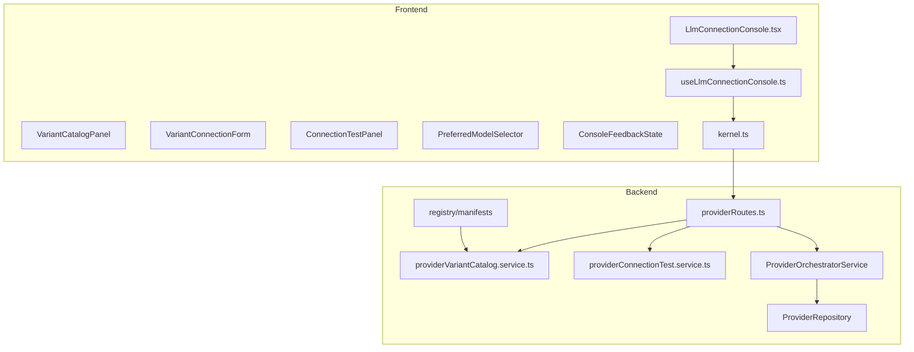

# Design Técnico — 007-llm-connection-console

## Visão Geral

Esta feature introduz uma nova arquitetura para gerenciamento de conexões LLM orientada por **variantes registradas em manifest**, com uma página dedicada `LlmConnectionConsole.tsx`. A implementação deve reutilizar o que já existe no domínio `providers`, mas sem perpetuar dois anti-patterns atuais:

1. `frontend/src/pages/ModelProviders.tsx` como página monolítica com `PROVIDER_OPTIONS` hardcoded.
2. `ProviderOrchestratorService`/`IModelCenterService` como centro único de toda regra futura de providers.

O design mantém compatibilidade transitória com o runtime legado (`openai`, `openai-codex`) apenas internamente no backend, enquanto a console pública passa a trabalhar com `openai-api`, `openai-oauth` e `ollama`.

---

## Architecture Overview



### Princípios

- **Manifest-first**: variantes exibidas na UI vêm do backend/registry.
- **Variant-first**: contratos, formulário e validação são orientados por variante e auth mode.
- **Compat mapping only inside backend**: qualquer mapeamento `openai-api -> openai` ou `openai-oauth -> openai-codex` fica encapsulado no backend.
- **Test before save**: testar e salvar são operações separadas.
- **Failure-safe sync**: falha de sync não apaga configuração ou seleção atual.

---

## Fluxos principais

### 1. Carregamento da console

1. `LlmConnectionConsole.tsx` carrega providers salvos e catálogo de variantes em paralelo.
2. O catálogo de variantes dirige cards, labels, descrição, capabilities e campos mínimos.
3. Se o catálogo vier vazio, a UI exibe estado vazio em vez de fallback hardcoded.

### 2. Teste de conexão antes de salvar

1. Usuário escolhe variante.
2. Usuário preenche payload temporário conforme auth mode da variante.
3. Frontend chama endpoint dedicado de teste.
4. Backend valida payload por variante e executa ping/check sem persistir.
5. UI mostra resultado estruturado.
6. Somente depois disso o usuário pode salvar a configuração.

### 3. Salvamento

1. Frontend converte o estado do formulário no payload compatível.
2. Backend aplica compat mapping interno se necessário.
3. Persistência continua usando o repositório atual.
4. A UI reidrata provider salvo, health e catálogo existente.

### 4. Sync e seleção de modelo

1. Usuário dispara sync no provider salvo.
2. Se sync funcionar, catálogo snapshot é atualizado.
3. Se sync falhar, configuração e `selectedModelIds` permanecem intactos.
4. UI exibe affordance de “modelo preferido/ativo”, mas persiste array compatível.

---

## Backend — arquivos prováveis

### Modificar

| Arquivo | Papel |
|---|---|
| `core/kernel/src/modules/providers/routes/providerRoutes.ts` | Adicionar endpoints de variants catalog e connection test; integrar contratos novos |
| `core/kernel/src/modules/providers/services/providerOrchestratorService.ts` | Reuso restrito para create/list/sync/catalog/select/health; adaptar compat mapping interno com cautela |
| `core/kernel/src/modules/providers/domain/entities/provider.entity.ts` | Ajustar tipos para suportar variante pública/metadata transitória, se necessário |
| `core/kernel/src/modules/providers/__tests__/providerOrchestrator.test.ts` | Cobrir garantias de sync/selectedModelIds e compat mapping interno |

### Criar

| Arquivo | Papel |
|---|---|
| `core/kernel/src/modules/providers/services/providerVariantCatalog.service.ts` | Resolver variantes registradas a partir de manifest/registry |
| `core/kernel/src/modules/providers/services/providerConnectionTest.service.ts` | Validar e testar payload temporário sem persistir |
| `core/kernel/src/modules/providers/domain/services/providerVariantMapper.ts` | Encapsular compat mapping `openai-api/openai-oauth/ollama` -> runtime atual |
| `core/kernel/src/modules/providers/routes/__tests__/providerRoutes.console.test.ts` | Testes HTTP para variants catalog e connection test |
| `core/kernel/src/modules/providers/services/__tests__/providerVariantCatalog.service.test.ts` | Testes unitários de leitura/filtragem de variantes |
| `core/kernel/src/modules/providers/services/__tests__/providerConnectionTest.service.test.ts` | Testes unitários de validação e resultado estruturado |

---

## Frontend — arquivos prováveis

### Modificar

| Arquivo | Papel |
|---|---|
| `frontend/src/api/kernel.ts` | Adicionar funções para variants catalog e connection test; tipar responses estruturadas |
| `frontend/src/hooks/useProviders.ts` | Reutilizar/incrementar hooks existentes quando fizer sentido |
| `frontend/src/pages/ModelProviders.tsx` | Marcar como legado/referência, sem expandir a lista hardcoded como solução alvo |
| `frontend/src/types/model.ts` | Introduzir tipos públicos orientados por variante/auth mode/health estruturado |

### Criar

| Arquivo | Papel |
|---|---|
| `frontend/src/pages/LlmConnectionConsole.tsx` | Página dedicada da nova console |
| `frontend/src/hooks/useLlmConnectionConsole.ts` | Orquestrar queries/mutations específicas da nova console |
| `frontend/src/components/providers/VariantCatalogPanel.tsx` | Listagem e seleção de variantes |
| `frontend/src/components/providers/VariantConnectionForm.tsx` | Formulário por variante/auth mode |
| `frontend/src/components/providers/ConnectionTestPanel.tsx` | Resultado do teste antes do save |
| `frontend/src/components/providers/PreferredModelSelector.tsx` | UI de seleção principal com persistência em `selectedModelIds` |
| `frontend/src/components/providers/VariantHealthSummary.tsx` | Adaptador visual para `HealthBadge` + mensagem estruturada |
| `frontend/src/pages/__tests__/LlmConnectionConsole.test.tsx` | Testes de renderização e fluxos da página |
| `frontend/src/hooks/__tests__/useLlmConnectionConsole.test.tsx` | Testes dos hooks da console |
| `frontend/src/components/providers/__tests__/...` | Testes dos componentes novos |

---

## Contratos a consumir/criar

O contrato atual `core/kernel/modules/providers/contracts/provider.contract.json` é insuficiente para a console v1. Este design recomenda introduzir contratos explícitos sob o mesmo domínio de providers.

### Criar contratos

| Arquivo | Objetivo |
|---|---|
| `core/kernel/modules/providers/contracts/provider-variant-catalog.contract.json` | Resposta de catálogo de variantes com grupo, variante, auth mode, fields, capabilities, status |
| `core/kernel/modules/providers/contracts/provider-connection-test.contract.json` | Request/response do teste de conexão, incluindo resultado estruturado |
| `core/kernel/modules/providers/contracts/provider-console-save.contract.json` | Payload público da console para salvar configuração por variante |
| `core/kernel/modules/providers/contracts/provider-health.contract.json` | Shape estruturado de health consumido pela console |

### Estrutura esperada — catálogo de variantes

```json
{
  "group": "providers",
  "variants": [
    {
      "variant": "openai-api",
      "moduleId": "providers-openai-api",
      "authMode": "api-key",
      "displayName": "OpenAI API",
      "capabilities": ["coding", "chat"],
      "requiredFields": ["apiKey"],
      "optionalFields": ["baseUrl", "organization"]
    }
  ]
}
```

### Estrutura esperada — connection test

```json
{
  "variant": "ollama",
  "config": {
    "baseUrl": "http://localhost:11434"
  }
}
```

```json
{
  "variant": "ollama",
  "ok": true,
  "health": {
    "status": "ok",
    "message": "Connection succeeded",
    "latencyMs": 42
  },
  "validatedFields": ["baseUrl"]
}
```

### Estrutura esperada — save payload público

```json
{
  "variant": "openai-oauth",
  "name": "openai-oauth:workspace-a",
  "auth": {
    "mode": "oauth-manual",
    "callbackUrl": "http://localhost:5173/oauth/callback?code=...&state=..."
  },
  "selectedModelIds": []
}
```

---

## Endpoints novos recomendados

### `GET /api/providers/variants`

Retorna as variantes registradas e suportadas pela console.

**Response**
- `200 OK` com `provider-variant-catalog.contract.json`

### `POST /api/providers/connection-test`

Executa teste de conexão sem persistir.

**Request**
- `provider-connection-test.contract.json`

**Response**
- `200 OK` com health estruturado e resultado do teste
- `400` para validação por variante
- `502/503` para falha de upstream/teste

### Endpoints existentes a reutilizar

- `POST /api/providers`
- `GET /api/providers`
- `DELETE /api/providers/:id`
- `POST /api/providers/:id/sync`
- `GET /api/providers/:id/models`
- `POST /api/providers/:id/models/select`
- `GET /api/providers/:id/health`
- `GET /api/providers/:id/health/stream`
- Rotas manuais atuais de Codex/OAuth, reutilizadas como base para `openai-oauth` se o design de implementação decidir adaptá-las em vez de duplicá-las

---

## Regras por variante

### `openai-api`

- Nome público da variante: `openai-api`
- Auth mode público: `api-key`
- Campos obrigatórios: `apiKey`
- Campos opcionais: `baseUrl`, `organization`
- Save permitido se validação local mínima passar e contrato da variante for satisfeito
- Teste de conexão obrigatório antes do save na UX da console

### `openai-oauth`

- Nome público da variante: `openai-oauth`
- Auth mode público: `oauth-manual`
- Não expor campo de segredo bruto
- Exibir metadados de início e inputs de conclusão compatíveis com o fluxo manual atual
- Save permitido somente por payload de conclusão OAuth compatível com a variante

### `ollama`

- Nome público da variante: `ollama`
- Auth mode público: `base-url`
- Campo obrigatório: `baseUrl`
- Teste de conexão verifica reachability sem persistir

---

## Saúde, sync e seleção de modelo

### Health

- Modelar `health` como objeto estruturado para a console:
  - `status`
  - `message`
  - `latencyMs?`
  - `checkedAt?`
  - `details?`
- `HealthBadge` pode continuar sendo reutilizado, mas mediado por um componente novo (`VariantHealthSummary`) para evitar lógica ad hoc na página.

### Sync

- `syncModels` continua usando infraestrutura atual.
- Em caso de erro, o service/route não deve sobrescrever catálogo salvo com vazio nem limpar `selectedModelIds`.
- A UI deve tratar erro de sync como erro operacional separado de erro de save/test.

### Seleção de modelo

- Persistência continua em `selectedModelIds`.
- A nova UI mostra um “preferred model” primário.
- Ao salvar seleção, o preferred model vira o primeiro item do array, mantendo compatibilidade.

---

## Anti-patterns explícitos a evitar

1. **Não** usar `PROVIDER_OPTIONS` hardcoded como source of truth.
2. **Não** exibir `openai` ou `openai-codex` como variantes públicas na nova console.
3. **Não** colapsar `openai-api` e `openai-oauth` em um único formulário indistinto.
4. **Não** persistir automaticamente o payload enviado ao teste de conexão.
5. **Não** limpar `selectedModelIds` quando um sync falhar.
6. **Não** ampliar `IModelCenterService` como façade obrigatória de toda a nova lógica; prefira serviços menores por responsabilidade.
7. **Não** prometer integração com router/channels nesta feature.

---

## Estratégia de testes

### Backend

- Testes unitários para `providerVariantCatalog.service`
- Testes unitários para `providerConnectionTest.service`
- Testes de rota para `GET /api/providers/variants`
- Testes de rota para `POST /api/providers/connection-test`
- Teste de não regressão para falha de sync preservar config e `selectedModelIds`

### Frontend

- Testes de hook para carregamento paralelo de variants + providers
- Testes da página para estados loading/empty/error
- Testes do formulário por variante
- Testes do fluxo `test connection -> save`
- Testes de seleção preferred model compatível com `selectedModelIds`
- Testes de exibição de health degradado/erro e erro de sync estruturado

---

## Decisões fechadas neste design

1. V1 suporta apenas `ollama`, `openai-api` e `openai-oauth`.
2. A source of truth do catálogo de variantes é backend + manifests/registry.
3. A UI pública usa os nomes de variantes do manifesto, sem arrays hardcoded como arquitetura alvo.
4. `openai-api` e `openai-oauth` continuam variantes distintas do ponto de vista de UX, contrato e validação.
5. Teste de conexão é endpoint dedicado e não persiste dados.
6. Falha de sync preserva config salva e `selectedModelIds`.
7. Persistência v1 continua em config + `selectedModelIds` + catalog snapshot; sem nova integração com router/channels.
