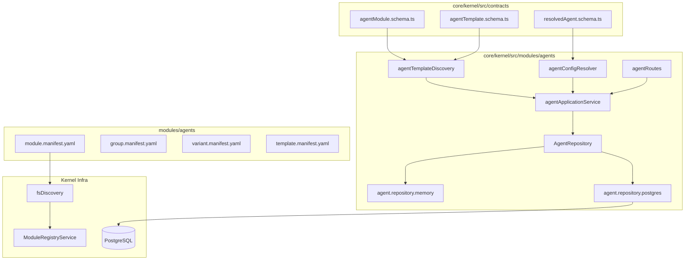
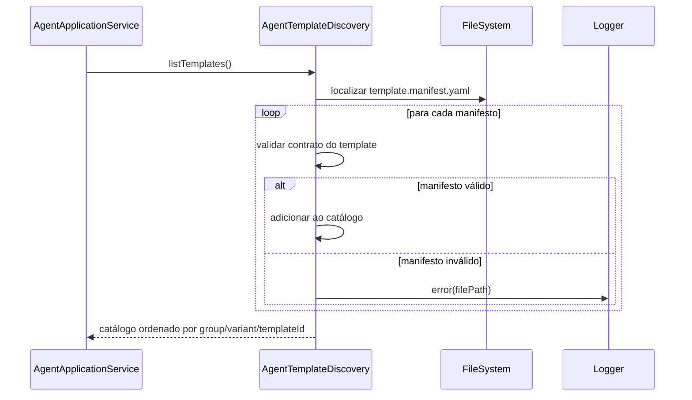

# Design Técnico — agents-module

## Visão Geral

Este documento descreve o design técnico do módulo de agentes do Andromeda SO V0.2.0. O módulo introduz uma base modular para criação, edição, exclusão lógica, duplicação, ativação/desativação, instanciação por template, descoberta de templates e carga estrita de agentes configuráveis.

O design preserva as regras constitucionais do projeto: raiz própria em `modules/agents/`, crescimento por grupos/variantes/templates, contratos canônicos no kernel, discovery declarativo, registry desacoplado e resolução determinística da configuração final do agente sem defaults ocultos fora da cadeia explicitamente permitida.

---

## Arquitetura



### Responsabilidades

1. `modules/agents/`: artefatos declarativos do módulo, grupos, variantes e templates.
2. `agentTemplateDiscovery`: varre o filesystem de templates e valida manifests.
3. `agentConfigResolver`: resolve a configuração final do agente com precedência fixa e rastreável.
4. `agentApplicationService`: coordena CRUD, discovery, resolução e carga.
5. `AgentRepository`: abstrai persistência das instâncias de agentes.
6. `agentRoutes`: expõe o contrato HTTP do módulo.

---

## Modelo de Domínio

O módulo `agents` DEVE tratar as seguintes entidades como contratos centrais do domínio, mesmo quando algumas forem materializadas como subdocumentos internos de `AgentInstance` e `ResolvedAgentConfig` em vez de tabelas independentes na v1:

### Entidades principais

1. `Agent`
   - Representa a instância persistida e editável do agente.
   - Mantém identidade própria, vínculo com `sourceTemplateId`, status, visibilidade, versão lógica, timestamps e overrides explícitos.
2. `AgentTemplate`
   - Representa o template declarativo descoberto no filesystem.
   - Define manifesto, configuração base, metadata, defaults, tests e scenarios.
3. `AgentResolvedConfig`
   - Representa o payload final e estritamente validado entregue ao runtime.
   - É sempre produzido pelo resolvedor determinístico e nunca persistido como fonte de verdade editável.
4. `AgentBehaviorProfile`
   - Agrupa os campos comportamentais resolvidos: `role`, `goal`, `personality`, `tone`, `responseStyle`, `systemInstructions`, `restrictions`, `securityRules`, `defaultLanguage`, `tags`.
   - Pode existir como subestrutura de `AgentTemplate.config`, `Agent.overrides` e `AgentResolvedConfig`.
5. `AgentExecutionPolicy`
   - Agrupa política de execução: `operationalParameters`, limites declarativos, estratégia de merge operacional e requisitos de carga estrita.
   - Define o que pode ser resolvido em tempo de carga sem defaults implícitos fora da cadeia oficial.
6. `AgentChannelPolicy`
   - Agrupa `allowedChannels`, integrações declaradas, bindings válidos de canal e regras de compatibilidade por operação.
7. `AgentModelPolicy`
   - Agrupa `preferredModel`, `compatibleModelStrategy`, bindings válidos de provider/model e restrições de compatibilidade.
8. `AgentAuditRecord`
   - Representa o registro rastreável de operações críticas do módulo: criação, edição, duplicação, ativação, desativação, exclusão lógica e carga.
   - Na v1 pode ser persistido como trilha simples de auditoria no PostgreSQL ou emitido em logger estruturado se a tabela dedicada ainda não existir, desde que o contrato de rastreabilidade permaneça explícito.

### Relação entre entidades

1. `AgentTemplate` fornece configuração base, metadata e defaults declarativos.
2. `Agent` referencia um `AgentTemplate` por `templateId` e preserva `sourceTemplateId` para rastreabilidade.
3. `AgentBehaviorProfile`, `AgentExecutionPolicy`, `AgentChannelPolicy` e `AgentModelPolicy` compõem tanto o template quanto a instância e o resultado resolvido.
4. `AgentResolvedConfig` consolida as políticas resolvidas e inclui `resolutionTrace` e `configHash`.
5. `AgentAuditRecord` referencia o `agentId`, o tipo da operação e o snapshot mínimo necessário para auditoria e debugging.

---

## Estrutura Declarativa do Módulo

```text
modules/
  agents/
    module.manifest.yaml
    README.md
    contracts/
      agent-instance.contract.json
      agent-template.contract.json
      resolved-agent.contract.json
    groups/
      default/
        group.manifest.yaml
        variants/
          base/
            variant.manifest.yaml
            templates/
              assistant/
                template.manifest.yaml
                config.yaml
                metadata.json
                scenarios/
                tests/
              reviewer/
                template.manifest.yaml
                config.yaml
                metadata.json
                scenarios/
                tests/
```

### `module.manifest.yaml`

```yaml
id: agents-catalog
name: agents-catalog
group: agents
variant: declarative-root
version: 1.0.0
entrypoint: modules/agents
contracts:
  input: modules/agents/contracts/agent-instance.contract.json
  output: modules/agents/contracts/resolved-agent.contract.json
capabilities:
  - agent-templates
  - agent-registry
  - agent-resolution
status: active
critical: true
dependencies: []
```

### `template.manifest.yaml`

Cada template define manifesto, configuração, metadata e parâmetros padrão herdáveis:

```yaml
templateId: assistant
name: Assistant Base
group: default
variant: base
version: 1.0.0
status: active
metadata:
  description: Assistant Base
  tags:
    - general
config:
  name: assistant
  slug: assistant
  role: assistant
  goal: Resolver tarefas gerais com previsibilidade.
  personality: objective
  tone: concise
  responseStyle: direct
  systemInstructions:
    - Responda com foco na tarefa atual.
  restrictions:
    - Nao invente capacidades nao declaradas.
  securityRules:
    - Nunca execute configuracao invalida.
  defaultLanguage: pt-BR
  visibility: private
  preferredModel: null
  compatibleModelStrategy: any-compatible
  allowedChannels:
    - chat
  enabledCapabilities:
    - reasoning
    - chat
defaults:
  operationalParameters:
    temperature: 0.2
    maxSteps: 8
tests:
  path: tests/
scenarios:
  path: scenarios/
```

### Responsabilidades por `groups` e `variants`

1. `groups/<group-name>/`
   - Define a família funcional do agente, como catálogos corporativos, assistentes operacionais ou perfis especializados.
   - Centraliza `group.manifest.yaml` e metadados compartilhados entre variantes.
2. `variants/<variant-name>/`
   - Define a estratégia concreta de composição dentro do grupo, como `base`, `regulated`, `sales`, `support`.
   - Centraliza `variant.manifest.yaml`, restrições herdadas e comportamento padrão de compatibilidade.
3. `templates/<template-id>/`
   - Define instâncias declarativas prontas para descoberta.
   - Cada template encapsula comportamento inicial, metadata, testes e cenários sem exigir alteração de código do kernel.

### Regra de responsabilidade entre core e módulo declarativo

1. `modules/agents/...` é a fonte declarativa de templates, manifests e contratos JSON do catálogo.
2. `core/kernel/src/contracts/...` é a fonte canônica de validação Zod consumida pelo runtime.
3. `core/kernel/src/modules/agents/...` implementa discovery, resolução, persistência, aplicação e API.
4. O core consome o módulo somente via manifests, registry, schemas e interfaces; nunca por acesso direto a detalhes internos de um template específico.

---

## Contratos Canônicos

### Contratos explícitos requeridos

O plano do módulo `agents` DEVE manter explícitos os seguintes contratos:

1. Contrato declarativo JSON de `AgentInstance` em `modules/agents/contracts/agent-instance.contract.json`.
2. Contrato declarativo JSON de `AgentTemplateManifest` em `modules/agents/contracts/agent-template.contract.json`.
3. Contrato declarativo JSON de `ResolvedAgentConfig` em `modules/agents/contracts/resolved-agent.contract.json`.
4. Contrato runtime Zod de `AgentInstance` em `core/kernel/src/contracts/agentModule.schema.ts`.
5. Contrato runtime Zod de `AgentTemplateManifest` em `core/kernel/src/contracts/agentTemplate.schema.ts`.
6. Contrato runtime Zod de `ResolvedAgentConfig` em `core/kernel/src/contracts/resolvedAgent.schema.ts`.
7. Contratos de entrada de aplicação para `create`, `update`, `duplicate`, `activate`, `deactivate` e `load`, derivados dos schemas canônicos sem duplicar regras de validação fora do kernel.

### `AgentInstance`

Localização: `core/kernel/src/contracts/agentModule.schema.ts`

```typescript
export const agentInstanceSchema = z.object({
  id: z.string().min(1),
  name: z.string().min(1),
  slug: z.string().min(1),
  description: z.string().default(''),
  templateId: z.string().min(1),
  sourceTemplateId: z.string().min(1),
  status: z.enum(['active', 'disabled']).default('active'),
  visibility: z.enum(['private', 'team', 'public']).default('private'),
  role: z.string().min(1),
  goal: z.string().min(1),
  personality: z.string().min(1),
  tone: z.string().min(1),
  responseStyle: z.string().min(1),
  systemInstructions: z.array(z.string().min(1)).default([]),
  restrictions: z.array(z.string().min(1)).default([]),
  securityRules: z.array(z.string().min(1)).default([]),
  defaultLanguage: z.string().min(1).default('pt-BR'),
  tags: z.array(z.string().min(1)).default([]),
  preferredModel: z.string().min(1).nullable().optional(),
  compatibleModelStrategy: z.string().min(1).nullable().optional(),
  allowedChannels: z.array(z.string().min(1)).default([]),
  enabledCapabilities: z.array(z.string().min(1)).default([]),
  overrides: z.object({
    name: z.string().min(1).optional(),
    description: z.string().optional(),
    role: z.string().min(1).optional(),
    goal: z.string().min(1).optional(),
    personality: z.string().min(1).optional(),
    tone: z.string().min(1).optional(),
    responseStyle: z.string().min(1).optional(),
    systemInstructions: z.array(z.string().min(1)).optional(),
    restrictions: z.array(z.string().min(1)).optional(),
    securityRules: z.array(z.string().min(1)).optional(),
    defaultLanguage: z.string().min(1).optional(),
    tags: z.array(z.string().min(1)).optional(),
    preferredModel: z.string().min(1).nullable().optional(),
    compatibleModelStrategy: z.string().min(1).nullable().optional(),
    allowedChannels: z.array(z.string().min(1)).optional(),
    enabledCapabilities: z.array(z.string().min(1)).optional(),
    operationalParameters: z.record(z.string(), z.unknown()).optional()
  }).default({}),
  deletedAt: z.string().nullable().default(null),
  version: z.number().int().positive().default(1),
  createdAt: z.string(),
  updatedAt: z.string()
});
```

### `AgentTemplateManifest`

Localização: `core/kernel/src/contracts/agentTemplate.schema.ts`

```typescript
export const agentTemplateManifestSchema = z.object({
  templateId: z.string().min(1),
  name: z.string().min(1),
  group: z.string().min(1),
  variant: z.string().min(1),
  version: z.string().min(1),
  status: z.enum(['active', 'disabled', 'deprecated']).default('active'),
  metadata: z.record(z.string(), z.unknown()).default({}),
  config: z.record(z.string(), z.unknown()),
  defaults: z.object({
    operationalParameters: z.record(z.string(), z.unknown()).default({})
  }),
  tests: z.record(z.string(), z.unknown()).default({}),
  scenarios: z.record(z.string(), z.unknown()).default({})
});
```

### `ResolvedAgentConfig`

Localização: `core/kernel/src/contracts/resolvedAgent.schema.ts`

```typescript
export const resolvedAgentSchema = z.object({
  agentId: z.string().min(1),
  templateId: z.string().min(1),
  sourceTemplateId: z.string().min(1),
  name: z.string().min(1),
  slug: z.string().min(1),
  description: z.string(),
  role: z.string().min(1),
  goal: z.string().min(1),
  personality: z.string().min(1),
  tone: z.string().min(1),
  responseStyle: z.string().min(1),
  systemInstructions: z.array(z.string().min(1)),
  restrictions: z.array(z.string().min(1)),
  securityRules: z.array(z.string().min(1)),
  defaultLanguage: z.string().min(1),
  tags: z.array(z.string().min(1)),
  status: z.enum(['active', 'disabled']),
  visibility: z.enum(['private', 'team', 'public']),
  preferredModel: z.string().min(1).nullable().optional(),
  compatibleModelStrategy: z.string().min(1).nullable().optional(),
  allowedChannels: z.array(z.string().min(1)),
  enabledCapabilities: z.array(z.string().min(1)),
  operationalParameters: z.record(z.string(), z.unknown()),
  bindings: z.object({
    provider: z.string().min(1).optional(),
    model: z.string().min(1).optional(),
    channel: z.string().min(1).optional()
  }).default({}),
  resolutionTrace: z.array(z.object({
    sourceType: z.enum(['template', 'template-defaults', 'agent-overrides', 'operational-parameters', 'bindings']),
    sourceId: z.string().min(1)
  })),
  configHash: z.string().min(1)
});
```

---

## Modelo de Persistência

### Persistência recomendada

1. `Agent` deve ser persistido em PostgreSQL como fonte primária, com fallback em memória para testes e desenvolvimento local.
2. `AgentTemplate` permanece declarativo no filesystem como fonte de verdade; indexação em banco é opcional e não pode substituir a descoberta por pasta.
3. `AgentResolvedConfig` deve ser calculado sob demanda para carga e pode opcionalmente gerar snapshot versionado, desde que o snapshot nunca substitua o algoritmo determinístico como fonte de verdade.
4. `AgentAuditRecord` é recomendado como persistência complementar para rastreabilidade operacional. Se não houver tabela dedicada na primeira entrega, a implementação deve ao menos garantir logger estruturado e campos estáveis para futura materialização.
5. A persistência deve preservar `version`, `deletedAt`, `createdAt`, `updatedAt`, `sourceTemplateId` e os blocos de política declarativa sem achatamentos que prejudiquem a resolução reproduzível.

### Interface `AgentRepository`

Localização: `core/kernel/src/modules/agents/domain/repositories/agent.repository.ts`

```typescript
export interface AgentRepository {
  list(): Promise<AgentInstance[]>;
  getById(id: string): Promise<AgentInstance | null>;
  create(agent: AgentInstance): Promise<AgentInstance>;
  update(agent: AgentInstance): Promise<AgentInstance>;
  softDelete(id: string): Promise<void>;
}
```

### Implementação PostgreSQL

Tabela principal sugerida:

```typescript
export const agentInstances = pgTable('agent_instances', {
  id: uuid('id').primaryKey().defaultRandom(),
  name: varchar('name', { length: 255 }).notNull(),
  slug: varchar('slug', { length: 255 }).notNull(),
  description: text('description').notNull().default(''),
  templateId: varchar('template_id', { length: 255 }).notNull(),
  sourceTemplateId: varchar('source_template_id', { length: 255 }).notNull(),
  status: varchar('status', { length: 20 }).notNull().default('active'),
  visibility: varchar('visibility', { length: 20 }).notNull().default('private'),
  overrides: jsonb('overrides').notNull().default({}),
  deletedAt: timestamp('deleted_at'),
  version: integer('version').notNull().default(1),
  createdAt: timestamp('created_at').defaultNow().notNull(),
  updatedAt: timestamp('updated_at').defaultNow().notNull()
});
```

### Implementação em memória

Usa `Map<string, AgentInstance>` e mantém o mesmo contrato de erro da implementação PostgreSQL para `getById`, `update` e `delete`.

### Factory do repositório

Segue o padrão já existente no kernel: PostgreSQL quando disponível, memória como fallback quando permitido.

### Evolução recomendada do storage

1. Tabela principal `agent_instances` para identidade, vínculo com template, status, visibilidade, overrides e ciclo de vida.
2. Snapshot resolvido opcional em `agent_resolved_snapshots` se a implementação precisar acelerar leitura, sempre associado a `agentId`, `version` e `configHash`.
3. Auditoria opcional em `agent_audit_records` com `agentId`, `operation`, `payload`, `createdAt`.
4. Nenhuma dessas estruturas pode remover a necessidade do resolvedor determinístico nem permitir execução de config parcial.

---

## Discovery de Templates

Localização: `core/kernel/src/modules/agents/domain/services/agentTemplateDiscovery.ts`

### Padrão de busca

```text
modules/agents/groups/*/variants/*/templates/*/template.manifest.yaml
```

### Fluxo



### Regras

1. Ordenação determinística por `group`, `variant`, `templateId`.
2. Duplicidade de `templateId` falha a descoberta.
3. Cada template deve conter manifesto, config, metadata, tests e scenarios válidos.
4. Alterações futuras no template não alteram automaticamente agentes já instanciados.

---

## Resolução da Configuração Final

Localização: `core/kernel/src/modules/agents/domain/services/agentConfigResolver.ts`

### Ordem de precedência

```text
1. template base
2. template defaults
3. agent overrides
4. explicit operational parameters
5. valid bindings for provider/model/channel when applicable
```

### Estratégia de merge

| Campo | Regra |
|---|---|
| escalares (`name`, `role`, `goal`, `tone`, `responseStyle`, `defaultLanguage`, `preferredModel`, `compatibleModelStrategy`, `status`, `visibility`) | último valor definido vence |
| `operationalParameters` | merge profundo por chave |
| `systemInstructions` | concatenação estável |
| `restrictions` | concatenação estável |
| `securityRules` | concatenação estável |
| `tags`, `allowedChannels`, `enabledCapabilities` | concatenação estável com deduplicação preservando ordem |

### Regra determinística de resolução

1. `template base` fornece o corpo inicial completo dos blocos `AgentBehaviorProfile`, `AgentExecutionPolicy`, `AgentChannelPolicy` e `AgentModelPolicy`.
2. `template defaults` só pode complementar `operationalParameters` e demais defaults declarados explicitamente no manifesto do template.
3. `agent overrides` só pode alterar campos permitidos da instância editável, preservando campos imutáveis de identidade e rastreabilidade.
4. `explicit operational parameters` só afeta `AgentExecutionPolicy.operationalParameters` no escopo da operação corrente.
5. `valid bindings` só afeta `bindings`, `preferredModel`, `compatibleModelStrategy` e aspectos derivados de canal/modelo quando a operação informar contexto válido.
6. Se um binding for incompatível com `allowedChannels`, `enabledCapabilities` ou com a política de modelo declarada, a resolução falha; não existe fallback silencioso.
7. Listas de governança (`restrictions`, `securityRules`) nunca são removidas implicitamente por fontes posteriores.
8. O `resolutionTrace` deve registrar cada fonte realmente aplicada, inclusive quando uma etapa não alterar campos mas for considerada na composição.
9. O `configHash` deve ser calculado a partir de serialização estável do `ResolvedAgentConfig` sem o próprio hash.

### Algoritmo

```typescript
resolve(agent: AgentInstance, catalog: AgentTemplateManifest[]): ResolvedAgentConfig {
  const sources = [
    baseTemplate,
    templateDefaults,
    agent.overrides,
    explicitOperationalParameters,
    validBindings
  ];

  const resolved = sources.reduce(applyMergeRules, emptyResolvedConfig());

  return resolvedAgentSchema.parse({
    agentId: agent.id,
    templateId: agent.templateId,
    ...resolved,
    resolutionTrace: buildTrace(sources),
    configHash: hashResolvedConfig(resolved)
  });
}
```

### Invariantes

1. Mesmo input gera mesmo `configHash`.
2. Não existem defaults implícitos fora da cadeia explícita de resolução.
3. `restrictions` e `securityRules` nunca são removidas implicitamente durante a composição.
4. Nenhum agente pode ser carregado sem `ResolvedAgentConfig` válido.

---

## Serviço de Aplicação

Localização: `core/kernel/src/modules/agents/services/agentApplicationService.ts`

```typescript
export class AgentApplicationService {
  constructor(
    private readonly repository: AgentRepository,
    private readonly templateDiscovery: AgentTemplateDiscovery,
    private readonly resolver: AgentConfigResolver
  ) {}

  listTemplates(): Promise<AgentTemplateManifest[]>;
  listAgents(): Promise<AgentInstance[]>;
  createAgent(input: CreateAgentInput): Promise<AgentInstance>;
  updateAgent(id: string, input: UpdateAgentInput): Promise<AgentInstance>;
  duplicateAgent(id: string): Promise<AgentInstance>;
  activateAgent(id: string): Promise<AgentInstance>;
  deactivateAgent(id: string): Promise<AgentInstance>;
  deleteAgent(id: string): Promise<void>;
  loadAgent(id: string, bindings?: AgentBindings, operationalParameters?: Record<string, unknown>): Promise<ResolvedAgentConfig>;
}
```

### Regras do serviço

1. `createAgent` valida referências a templates antes de persistir e materializa configuração inicial editável.
2. `updateAgent` reaplica validação e incrementa `version`.
3. `duplicateAgent` copia a configuração editável sem reutilizar identificadores ou timestamps.
4. `deleteAgent` realiza soft delete por padrão.
5. `loadAgent` consulta instância, descobre catálogo atual, resolve configuração com bindings e parâmetros explícitos quando fornecidos e retorna `ResolvedAgentConfig` validado.
6. O serviço usa logger Pino nomeado `agents-module`.

### Superfície explícita de uso

1. Superfície interna do domínio:
   - `AgentRepository`
   - `AgentTemplateDiscovery`
   - `AgentConfigResolver`
   - `AgentApplicationService`
2. Superfície de integração com o core:
   - manifesto do módulo em `modules/agents/module.manifest.yaml`
   - contracts JSON do módulo em `modules/agents/contracts/*.json`
   - schemas canônicos do kernel em `core/kernel/src/contracts/*.ts`
   - registry/discovery do kernel consumindo apenas manifests e contratos
3. Superfície de uso operacional:
   - criação de agente por template
   - edição de overrides explícitos
   - soft delete
   - duplicação
   - ativação/desativação
   - listagem de catálogo
   - carga estrita do agente resolvido

---

## Contrato HTTP

Localização: `core/kernel/src/modules/agents/routes/agentRoutes.ts`

### Endpoints

1. `GET /api/agents/templates`
2. `GET /api/agents`
3. `GET /api/agents/:id`
4. `POST /api/agents`
5. `PUT /api/agents/:id`
6. `DELETE /api/agents/:id`
7. `POST /api/agents/:id/duplicate`
8. `POST /api/agents/:id/activate`
9. `POST /api/agents/:id/deactivate`
10. `POST /api/agents/:id/load`

### Exemplos

```typescript
server.post('/', async function handleCreate(request, reply) {
  const service = await getAgentApplicationService();
  const agent = await service.createAgent(request.body as CreateAgentInput);
  return reply.status(201).send(agent);
});

server.post('/:id/load', async function handleLoad(request, reply) {
  const service = await getAgentApplicationService();
  const { id } = request.params as { id: string };
  const resolved = await service.loadAgent(id);
  return reply.status(200).send(resolved);
});
```

### Contratos explícitos de entrada e saída

1. `GET /api/agents/templates`
   - saída: `AgentTemplateManifest[]`
2. `GET /api/agents`
   - saída: `Agent[]` ativos por padrão
3. `GET /api/agents/:id`
   - saída: `Agent`
4. `POST /api/agents`
   - entrada: `CreateAgentInput`
   - saída: `Agent`
5. `PUT /api/agents/:id`
   - entrada: `UpdateAgentInput`
   - saída: `Agent`
6. `DELETE /api/agents/:id`
   - saída: confirmação sem hard delete
7. `POST /api/agents/:id/duplicate`
   - saída: `Agent`
8. `POST /api/agents/:id/activate`
   - saída: `Agent`
9. `POST /api/agents/:id/deactivate`
   - saída: `Agent`
10. `POST /api/agents/:id/load`
   - entrada: `AgentBindings` e `operationalParameters` explícitos opcionais
   - saída: `AgentResolvedConfig`

### Integração com core por manifestos, registry e contratos

1. O módulo deve se registrar no discovery do kernel por `module.manifest.yaml` na raiz `modules/agents/`.
2. O registry do kernel deve tratar `agents` como módulo declarativo crítico, sem acoplamento ao conteúdo de um template específico.
3. O discovery do catálogo de templates do módulo deve ocorrer por leitura de pasta e validação dos contratos canônicos.
4. O kernel deve depender das interfaces e schemas do módulo para listar templates, instanciar agentes e carregar `ResolvedAgentConfig`.
5. O runtime nunca deve reconstruir manualmente partes de template fora do `AgentConfigResolver`.

---

## Testes

## Estratégia de Testabilidade e TDD

1. A implementação deve começar por contratos e testes, não por rotas ou persistência.
2. Ordem recomendada de TDD:
   - schemas canônicos
   - fixtures de template declarativo
   - tests de discovery
   - tests de resolução determinística
   - tests do repositório em memória
   - tests do serviço de aplicação
   - tests HTTP de integração
3. Cada teste deve validar comportamento reproduzível, especialmente `resolutionTrace`, `configHash`, `version`, `deletedAt` e bloqueio de carga de agente inválido ou desativado.
4. Fixtures de template devem viver sob a estrutura real `modules/agents/groups/.../templates/...` para testar discovery de forma fiel ao filesystem.
5. Nenhum teste deve depender de defaults implícitos não declarados no template, no override, na operação ou no binding.

### Unitários

1. descoberta de templates válidos e inválidos;
2. rejeição de duplicidade de `templateId`;
3. rejeição de manifestos incompletos sem `config`, `metadata`, `tests` ou `scenarios`;
4. resolução determinística com mesmo hash para mesma entrada;
5. ausência de defaults implícitos fora da cadeia permitida;
6. bindings válidos alteram `resolutionTrace` e `configHash` apenas quando aplicáveis;
7. `AgentRepositoryMemory` cobre create, update, soft delete e not found.

### Integração

1. `GET /api/agents/templates` retorna catálogo descoberto;
2. `POST /api/agents` cria instância válida;
3. `PUT /api/agents/:id` atualiza e incrementa versão;
4. `DELETE /api/agents/:id` marca instância como excluída logicamente;
5. `POST /api/agents/:id/duplicate` cria nova instância válida;
6. `POST /api/agents/:id/activate` e `POST /api/agents/:id/deactivate` alteram o status;
7. `POST /api/agents/:id/load` retorna `ResolvedAgentConfig` válido.

### Checkpoints obrigatórios

1. após cada task backend: `cd core/kernel && npx tsc --noEmit`
2. após tasks de teste: `cd core/kernel && npm run test`
