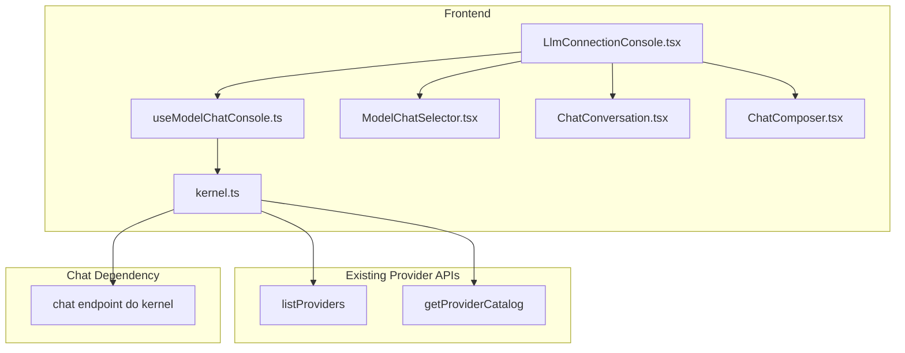

# Design Técnico — Frontend Chat Console

## Visão Geral

Esta feature converte a aba `models` em um console de bate-papo enxuto, orientado por um **modelo selecionado** e por um **histórico local em memória**. O frontend continua usando os endpoints já existentes para descobrir providers e catálogos sincronizados, mas reduz a experiência da tela para apenas quatro responsabilidades:

1. listar modelos disponíveis;
2. selecionar um modelo;
3. enviar mensagens com o histórico atual;
4. renderizar respostas, loading, erro e limpeza da conversa.

O design evita qualquer expansão para gestão de providers. A implementação deve tratar a existência de uma rota de chat do kernel como **pré-condição externa**. Se a rota não existir no momento da implementação, o trabalho deve ser interrompido e reportado.

---

## Architecture Overview



### Princípios

- **Chat-first**: a tela existe para conversar, não para administrar providers.
- **Model-first**: toda conversa fica associada ao modelo atualmente selecionado.
- **Local-only conversation**: o histórico da conversa vive apenas em memória React.
- **No fake backend**: sem endpoint de chat real, a implementação deve parar.
- **Minimal changes**: aproveitar a aba `models` e a base visual já existentes.

---

## Fluxos principais

### 1. Carregamento da tela

1. A página carrega a lista de providers existentes.
2. Para cada provider existente, o frontend consulta o catálogo já sincronizado.
3. Os modelos retornados são achatados em uma única lista para o combobox.
4. Se não houver modelos, a página mostra estado vazio e desabilita o composer.

### 2. Seleção de modelo

1. O usuário escolhe um item no combobox.
2. O item selecionado passa a ser a origem de verdade para os próximos envios.
3. Se houver conversa atual, a troca de modelo limpa o histórico e o erro atual.

### 3. Envio de mensagem

1. O usuário digita uma mensagem.
2. O frontend valida que existe modelo selecionado e texto não-vazio.
3. O frontend adiciona a mensagem do usuário ao histórico local.
4. O frontend envia ao backend o `modelId` selecionado e o histórico atual serializado.
5. Enquanto a request estiver em andamento, a UI mostra loading e bloqueia novo envio.
6. Quando a resposta chega, a mensagem do assistente é adicionada ao histórico.

### 4. Erro de envio

1. Se a request falhar, o frontend encerra o loading.
2. A conversa anterior permanece visível.
3. A UI exibe erro amigável próximo ao composer ou via `ToastNotification`.

### 5. Limpeza da conversa

1. O usuário aciona `Clear conversation`.
2. A UI remove todas as mensagens e qualquer erro atual.
3. O modelo selecionado permanece inalterado.

---

## Arquivos prováveis

### Modificar

| Arquivo | Papel |
|---|---|
| `frontend/src/pages/LlmConnectionConsole.tsx` | Substituir a tela atual por uma experiência focada apenas em chat |
| `frontend/src/api/kernel.ts` | Adicionar a função de chamada ao endpoint de chat e helpers de agregação de modelos |
| `frontend/src/types/model.ts` | Definir tipos da mensagem de chat, item do combobox e payload/resposta de chat |

### Criar

| Arquivo | Papel |
|---|---|
| `frontend/src/hooks/useModelChatConsole.ts` | Orquestrar modelos disponíveis, estado local da conversa e mutação de envio |
| `frontend/src/components/chat/ModelChatSelector.tsx` | Combobox de modelos disponíveis |
| `frontend/src/components/chat/ChatConversation.tsx` | Lista de mensagens da conversa atual |
| `frontend/src/components/chat/ChatComposer.tsx` | Campo de texto, botão de enviar, botão de limpar e feedback inline |
| `frontend/src/pages/__tests__/LlmConnectionConsole.test.tsx` | Testes da página no fluxo de chat |
| `frontend/src/hooks/__tests__/useModelChatConsole.test.tsx` | Testes do hook agregado |
| `frontend/src/components/chat/__tests__/...` | Testes dos componentes novos |

---

## Modelo de dados

### Mensagem da conversa

```ts
type ChatRole = 'user' | 'assistant';

interface ChatMessage {
  id: string;
  role: ChatRole;
  content: string;
}
```

### Item do combobox

```ts
interface ChatModelOption {
  providerId: string;
  providerName: string;
  modelId: string;
  displayName: string;
  label: string;
}
```

### Payload de chat esperado pelo frontend

> Contrato assumido. Não implementar backend nesta spec.

```ts
interface SendChatMessageRequest {
  modelId: string;
  messages: Array<{
    role: 'user' | 'assistant';
    content: string;
  }>;
}

interface SendChatMessageResponse {
  message: {
    role: 'assistant';
    content: string;
  };
}
```

Se o contrato real do backend divergir, a implementação deve parar e solicitar alinhamento via spec backend.

---

## Hook agregado

`useModelChatConsole.ts` deve centralizar a orquestração da tela.

Responsabilidades:

- carregar providers;
- carregar catálogos existentes;
- gerar a lista achatada de modelos do combobox;
- manter `selectedModelId`;
- manter `messages` em memória;
- manter `draft` e `errorMessage`;
- expor `sendMessage`, `clearConversation` e `selectModel`.

Shape sugerido:

```ts
function useModelChatConsole(): {
  modelOptions: ChatModelOption[];
  selectedModelId: string | null;
  messages: ChatMessage[];
  draft: string;
  isLoadingModels: boolean;
  isSending: boolean;
  errorMessage: string | null;
  setDraft: (value: string) => void;
  selectModel: (modelId: string) => void;
  sendMessage: () => Promise<void>;
  clearConversation: () => void;
}
```

---

## Regras de comportamento

### Seleção de modelo

- O primeiro modelo disponível pode ser pré-selecionado automaticamente.
- Trocar o modelo limpa a conversa atual.
- Durante envio, a seleção fica bloqueada.

### Composer

- O campo aceita texto livre.
- O envio com Enter é permitido se o componente final usar comportamento compatível com multiline definido pela implementação.
- O botão de enviar fica desabilitado sem modelo, sem texto útil ou durante loading.

### Histórico

- Mensagens do usuário e do assistente têm estilos visuais distintos.
- A lista pode rolar verticalmente para suportar conversas mais longas.
- Não há paginação, persistência nem múltiplas conversas.

### Erros

- Erro de carregamento dos modelos: estado principal da página.
- Erro de envio: feedback local da conversa sem apagar o histórico.
- Erro vazio/fallback: usar mensagem amigável curta.

---

## Estratégia de dados para modelos disponíveis

Como a feature não cobre gestão de catálogo, o frontend apenas compõe o que já existe:

1. `listProviders()` retorna providers existentes.
2. `getProviderCatalog(providerId)` retorna modelos já sincronizados daquele provider.
3. O hook gera `ChatModelOption[]` combinando os resultados.

Regras:

- ignorar providers sem catálogo ou sem modelos;
- manter rótulo desambiguado, por exemplo `GPT-4o - openai-api` ou `Qwen 2.5 14B - ollama`;
- não disparar sync automático;
- não alterar `selectedModelIds` nem preferências de provider.

---

## Anti-patterns explícitos a evitar

1. **Não** reintroduzir controles de provider na tela de chat.
2. **Não** adicionar benchmark, router intelligence ou métricas na página.
3. **Não** persistir histórico em localStorage, backend ou query string.
4. **Não** inventar mock em produção para ausência do endpoint de chat.
5. **Não** fazer sync automático de catálogo ao entrar na tela.

---

## Estratégia de testes

### Hook

- agrega modelos de múltiplos providers em uma lista única;
- limpa conversa ao trocar de modelo;
- preserva histórico anterior em caso de erro de envio;
- limpa mensagens e erro quando `clearConversation` é acionado.

### Página

- estado loading de modelos;
- estado vazio quando não há modelos disponíveis;
- envio com sucesso adiciona mensagem do usuário e resposta do assistente;
- envio com erro mostra feedback amigável;
- ação de limpar remove histórico e mantém o modelo selecionado.

### Componentes

- combobox renderiza opções corretas;
- conversation renderiza estilos distintos por `role`;
- composer respeita `disabled` e mostra loading/erro.
