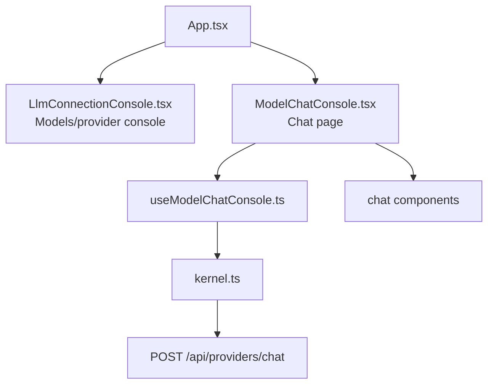

# Design — Frontend Chat on Separate Page

## Overview

This is a corrective frontend spec. The current implementation put the chat UI inside `frontend/src/pages/LlmConnectionConsole.tsx`, which displaced the approved Models/provider console.

The fix is to restore `LlmConnectionConsole.tsx` as the Models console and move the chat UI to its own page entry with the smallest practical set of file changes.

The backend is already in place for chat via `POST /api/providers/chat`. This spec does not change backend behavior.

---

## Design Goals

- Restore the Models page to its approved role
- Keep chat available, but on a separate page entry
- Reuse the existing chat hook/components already created
- Minimize churn in routing, naming, and component structure
- Avoid any provider-management expansion beyond restoring the Models console

---

## Routing decision

The current app shell in `frontend/src/App.tsx` uses query-param tab routing (`/?tab=...`). To minimize churn, this corrective change should keep that pattern.

### Decision

- Preserve `?tab=models` as the entry for the restored `LlmConnectionConsole`
- Add a new `?tab=chat` entry for the chat page
- Keep the existing `BrowserRouter` + `Routes` structure unchanged apart from the new tab option

This is a separate page entry from the user perspective while avoiding a larger router refactor.

---

## Target architecture

---

## File plan

### Update

| File | Purpose |
|---|---|
| `frontend/src/App.tsx` | Add separate `chat` tab/page entry while keeping `models` mapped to the restored Models console |
| `frontend/src/pages/LlmConnectionConsole.tsx` | Restore the provider/model management console content instead of the current chat-first UI |
| `frontend/src/pages/ModelProviders.tsx` | Point to the restored Models console behavior if this compatibility wrapper is still used |
| `frontend/src/pages/__tests__/LlmConnectionConsole.test.tsx` | Replace chat-first assertions with regression coverage for the restored Models console |
| `frontend/src/hooks/__tests__/useModelChatConsole.test.tsx` | Keep chat-hook coverage aligned with the new separate page entry if needed |

### Create

| File | Purpose |
|---|---|
| `frontend/src/pages/ModelChatConsole.tsx` | New dedicated frontend page for chat, reusing the existing chat hook/components |
| `frontend/src/pages/__tests__/ModelChatConsole.test.tsx` | Page-level tests for the separate chat page behavior and routing entry |

### Reuse without architectural change

| File | Purpose |
|---|---|
| `frontend/src/hooks/useModelChatConsole.ts` | Keep the existing chat state/orchestration logic |
| `frontend/src/components/chat/ChatComposer.tsx` | Reuse as-is or with minimal page-wiring adjustments only |
| `frontend/src/components/chat/ChatConversation.tsx` | Reuse existing conversation rendering |
| `frontend/src/components/chat/ModelChatSelector.tsx` | Reuse existing model selector |
| `frontend/src/api/kernel.ts` | Reuse existing frontend call to `POST /api/providers/chat` |

---

## Restoration strategy for Models

`frontend/src/pages/LlmConnectionConsole.tsx` must stop being the chat host and return to the provider/model management console role established by the approved Models work.

### Restoration rules

1. Restore the provider/model management layout and behaviors previously intended for `LlmConnectionConsole.tsx`.
2. Do not leave chat-first copy, chat-only scope guards, or chat conversation UI in this file.
3. Preserve existing provider/model console capabilities rather than redesigning them.
4. If the current repository still has reusable provider-console pieces from the earlier implementation, reuse them instead of rebuilding.
5. `frontend/src/pages/ModelProviders.tsx` should remain a thin compatibility wrapper only if that minimizes churn; otherwise it should simply align with the restored Models console entry.

---

## New chat page behavior

The new `frontend/src/pages/ModelChatConsole.tsx` should host the already-implemented chat UI with minimal relocation.

### Page responsibilities

1. Load and present available model options from existing frontend data sources
2. Allow selecting a model
3. Allow sending a message
4. Show assistant responses in the current conversation
5. Show loading/error feedback
6. Allow clearing the current in-memory conversation

### Explicit non-responsibilities

1. No provider creation/edit/delete/auth
2. No manual catalog sync controls
3. No benchmark or router intelligence UI
4. No conversation persistence

---

## Data flow for chat page

1. `ModelChatConsole.tsx` uses `useModelChatConsole.ts`
2. The hook composes available models from existing provider/catalog APIs
3. On send, the hook calls the existing frontend API helper that posts to `POST /api/providers/chat`
4. The page renders user/assistant messages, loading, inline error, and clear conversation state

No new backend contract is introduced here.

---

## UI and navigation behavior

### Navigation

- Add a visible navigation entry labeled `Chat`
- Keep `Models` labeled as `Models`
- `Models` must open the restored provider/model console
- `Chat` must open the separate chat page

### Copy guidance

- `Models` copy should again describe connection/provider/model management
- `Chat` copy can remain chat-oriented
- Avoid copy that implies the Models page is chat-first

---

## Anti-patterns to avoid

1. Do not keep chat inside `LlmConnectionConsole.tsx`
2. Do not repurpose `Models` as an alias for chat
3. Do not rewrite the app router beyond what is needed for a separate page entry
4. Do not add new backend endpoints or new provider-management scope
5. Do not rename or move the existing chat hook/components unless strictly required by implementation details

---

## Test strategy

### Models restoration tests

Update `frontend/src/pages/__tests__/LlmConnectionConsole.test.tsx` to prove:

1. `LlmConnectionConsole` renders the provider/model management console, not the chat-first screen
2. Chat-only content no longer appears on the Models page
3. Approved Models console behaviors still render/work at the page level

### Separate chat page tests

Add `frontend/src/pages/__tests__/ModelChatConsole.test.tsx` to prove:

1. The chat page is rendered from the separate `chat` route/tab entry
2. The chat page shows model selection and conversation UI
3. Successful send appends user and assistant messages
4. Error send preserves prior conversation and shows friendly feedback
5. Clear conversation removes messages and current error while preserving the selected model

### App-level navigation coverage

Add or update page/app tests as needed to prove:

1. `?tab=models` resolves to the restored Models console
2. `?tab=chat` resolves to the separate chat page
3. The two entries stay distinct

---

## Closed decisions

1. The current chat-first replacement is treated as incorrect and must be reversed.
2. `LlmConnectionConsole.tsx` returns to being the Models/provider console.
3. Chat remains in frontend scope only and reuses `POST /api/providers/chat`.
4. The separate chat entry should be added through the existing tab/query routing pattern in `App.tsx` to minimize churn.
5. Existing chat hook/components should be reused rather than redesigned.
