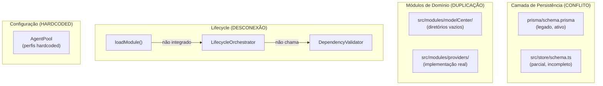
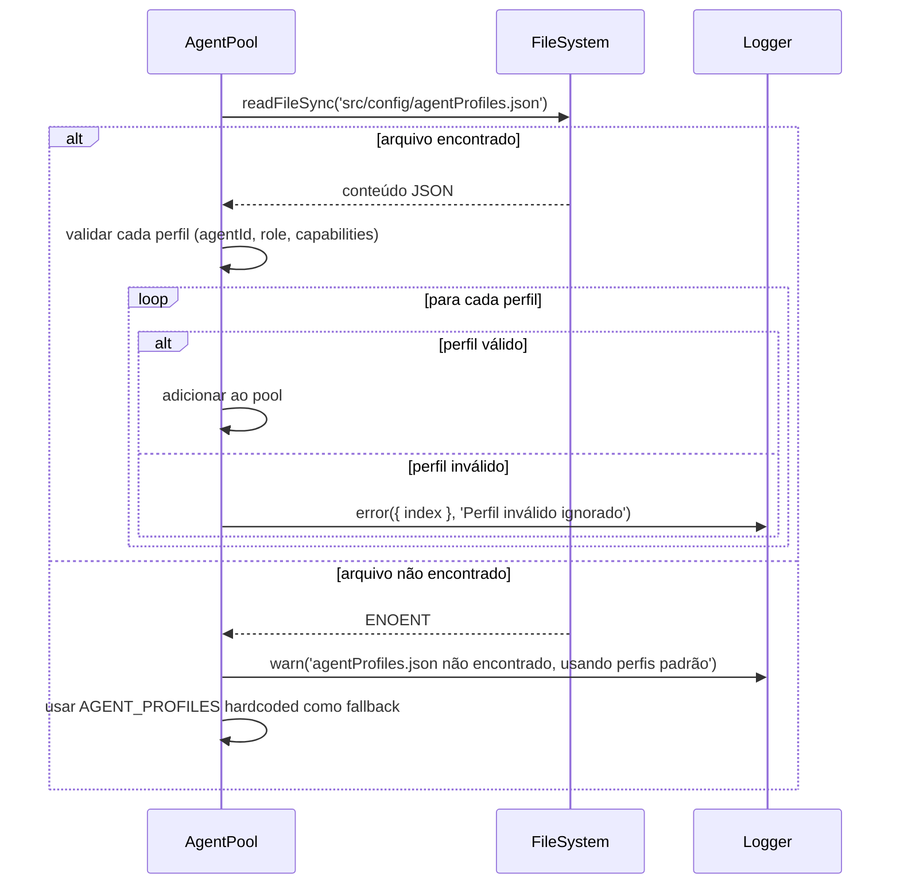
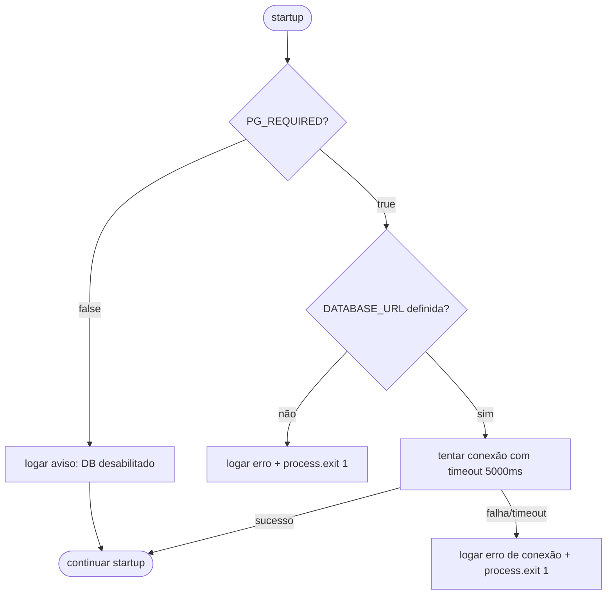
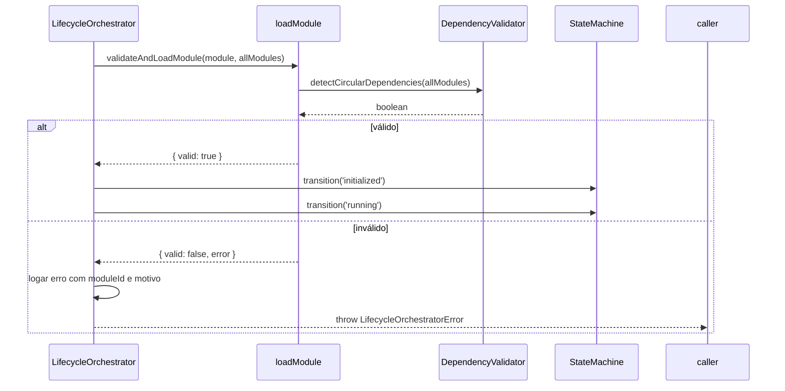
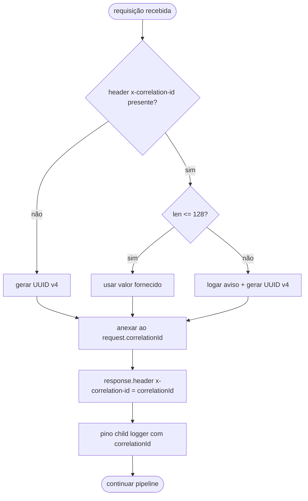

# Design Técnico: kernel-consolidation

## Visão Geral

Este documento descreve o design técnico para a consolidação do `andromeda-core-kernel`. O objetivo é eliminar inconsistências acumuladas: remoção do Prisma em favor do Drizzle como ORM único, alinhamento do schema de banco de dados com as entidades de domínio reais, unificação do módulo `modelCenter` com o módulo `providers`, documentação explícita de mocks e benchmarks simulados, configuração dinâmica do `AgentPool`, validação de ambiente no startup, integração do `DependencyValidator` no fluxo de carregamento de módulos, documentação do Redis como recurso reservado e introdução de correlation IDs nas requisições HTTP.

O resultado esperado é um kernel com uma única fonte de verdade para cada responsabilidade, sem código morto, sem ambiguidade sobre o que é real versus simulado, e com cobertura de testes adequada para os fluxos críticos.

---

## Arquitetura

### Visão atual (estado problemático)



### Visão alvo (estado consolidado)

```mermaid
graph TD
    subgraph ORM["Camada de Persistência (DRIZZLE ÚNICO)"]
        Schema["src/store/schema.ts\n(completo: 6 tabelas)"]
        DrizzleConfig["drizzle.config.ts\n(única fonte de migrations)"]
    end

    subgraph Modules["Módulos de Domínio (UNIFICADO)"]
        Prov["src/modules/providers/\n(catálogo + benchmark + roteamento)"]
        IMS["IModelCenterService\n(interface de contrato)"]
        Prov -->|"implementa"| IMS
    end

    subgraph Lifecycle["Lifecycle (INTEGRADO)"]
        LO["LifecycleOrchestrator.start()"]
        LM["loadModule() + validateAndLoadModule()"]
        DV["DependencyValidator"]
        LO -->|"1. chama"| LM
        LM -->|"2. chama"| DV
        DV -->|"3. resultado"| LM
        LM -->|"4. resultado"| LO
    end

    subgraph Config["Configuração (EXTERNA)"]
        AP["AgentPool"]
        JSON["src/config/agentProfiles.json"]
        AP -->|"carrega"| JSON
    end

    subgraph HTTP["Camada HTTP (FASTIFY)"]
        CorrPlugin["correlationIdPlugin\n(Fastify plugin)"]
        Server["server.ts"]
        EnvValidator["validateEnvironment()\n(antes das rotas)"]
        Server -->|"1. executa"| EnvValidator
        Server -->|"2. registra"| CorrPlugin
    end

    subgraph Store["Recursos Reservados"]
        Redis["src/store/redisClient.ts\n(@deprecated, documentado)"]
    end
```



---

## Componentes e Interfaces

### 1. Schema Drizzle Consolidado (`src/store/schema.ts`)

O schema atual define apenas `modules_registry` e `lifecycle_events`. Ele precisa ser expandido para cobrir todas as entidades persistidas pelo módulo providers.

**Tabelas a adicionar:**

| Tabela | Responsabilidade |
|---|---|
| `providers` | Registro de integrações LLM |
| `model_catalog_items` | Catálogo de modelos por provider |
| `model_benchmark_results` | Resultados de benchmarks simulados |
| `routing_decisions` | Histórico de decisões de roteamento LLM |

**Tabelas existentes (sem alteração):**

| Tabela | Responsabilidade |
|---|---|
| `modules_registry` | Registro de módulos do kernel |
| `lifecycle_events` | Histórico de transições de estado |

### 2. Interface `IModelCenterService`

Localização: `src/modules/providers/domain/interfaces/modelCenter.interface.ts`

```typescript
export interface IModelCenterService {
  getCatalog(providerIdOrName: string): Promise<{
    providerId: string;
    selectedModelIds: string[];
    models: ModelCatalogItem[];
  }>;
  benchmarkModel(modelId: string, taskType: TaskType): Promise<ModelBenchmarkResult & { simulated: true }>;
  inferRoute(taskType: TaskType): Promise<{
    decision: { taskType: TaskType; selectedModel: string; score: number };
    ranked: Array<{ modelId: string; score: number; latencyMs: number }>;
  }>;
}
```

O `ProviderOrchestratorService` implementa esta interface. A interface permite substituição futura por uma implementação que realize inferência real.

### 3. Mock Adapters documentados

Cada adapter em `src/modules/providers/infrastructure/adapters/` recebe:

- JSDoc no topo do arquivo declarando que é uma implementação simulada
- Comentário inline em `ping()` indicando latência fixa simulada
- Comentário inline em `listModels()` indicando dados de seed estáticos
- Comentário `TODO` padronizado indicando o caminho para implementação real

**Formato do TODO padronizado:**
```typescript
// TODO(real-integration): Substituir por chamada HTTP real à API do provider.
// Referência: https://platform.openai.com/docs/api-reference/models/list
```

### 4. AgentPool configurável

**Fluxo de carregamento:**



**Schema de validação de AgentProfile (Zod):**
```typescript
const AgentProfileSchema = z.object({
  agentId: z.string().min(1),
  role: z.enum(['planner', 'designer', 'copywriter', 'coder', 'reviewer']),
  capabilities: z.array(z.string()).min(1)
});
```

### 5. Validação de ambiente no startup

**Localização:** `src/config/validateEnvironment.ts`

**Fluxo:**



A função `validateEnvironment()` é chamada em `server.ts` **antes** de qualquer `server.register()`.

### 6. Integração do DependencyValidator no LifecycleOrchestrator

**Fluxo atual (problemático):** `LifecycleOrchestrator.start()` executa transições de estado sem chamar `validateAndLoadModule()`.

**Fluxo alvo:**



### 7. Correlation ID Plugin (Fastify)

**Localização:** `src/plugins/correlationId.plugin.ts`

**Lógica:**



O plugin usa `fastify.decorateRequest('correlationId', '')` e é registrado como o primeiro plugin em `server.ts`.

### 8. Redis como recurso reservado (`src/store/redisClient.ts`)

O arquivo `src/store/redis.ts` atual instancia o cliente Redis imediatamente no import, o que causa falha se `REDIS_URL` não estiver definida. O novo `redisClient.ts` documenta o Redis como reservado e não instancia o cliente automaticamente.

---

## Modelos de Dados

### Schema Drizzle completo (`src/store/schema.ts`)

```typescript
// Tabelas existentes (sem alteração)
export const modulesRegistry = pgTable('modules_registry', { ... });
export const lifecycleEvents = pgTable('lifecycle_events', { ... });

// Novas tabelas
export const providers = pgTable('providers', {
  id: uuid('id').primaryKey().defaultRandom(),
  name: varchar('name', { length: 255 }).notNull().unique(),
  type: varchar('type', { length: 50 }).notNull(),
  displayName: varchar('display_name', { length: 255 }).notNull(),
  apiBase: varchar('api_base', { length: 500 }),
  baseUrl: varchar('base_url', { length: 500 }),
  apiKeyEnc: text('api_key_enc'),
  health: varchar('health', { length: 20 }).notNull().default('warning'),
  selectedModelIds: jsonb('selected_model_ids').notNull().default([]),
  createdAt: timestamp('created_at').defaultNow().notNull()
});

export const modelCatalogItems = pgTable('model_catalog_items', {
  id: uuid('id').primaryKey().defaultRandom(),
  providerId: uuid('provider_id').notNull().references(() => providers.id, { onDelete: 'cascade' }),
  modelId: varchar('model_id', { length: 255 }).notNull(),
  displayName: varchar('display_name', { length: 255 }).notNull(),
  capabilities: jsonb('capabilities').notNull().default([]),
  score: real('score').notNull().default(0),
  latencyMs: integer('latency_ms').notNull().default(0),
  costUsd: real('cost_usd'),
  priceLabel: varchar('price_label', { length: 100 }),
  contextWindow: varchar('context_window', { length: 50 }),
  createdAt: timestamp('created_at').defaultNow().notNull()
});

export const modelBenchmarkResults = pgTable('model_benchmark_results', {
  id: uuid('id').primaryKey().defaultRandom(),
  modelId: varchar('model_id', { length: 255 }).notNull(),
  taskType: varchar('task_type', { length: 50 }).notNull().default('chat'),
  score: real('score').notNull(),
  latencyMs: integer('latency_ms').notNull(),
  tokensIn: integer('tokens_in').notNull().default(0),
  tokensOut: integer('tokens_out').notNull().default(0),
  costUsd: real('cost_usd'),
  success: boolean('success').notNull().default(true),
  simulated: boolean('simulated').notNull().default(true),
  executedAt: timestamp('executed_at').defaultNow().notNull()
});

export const routingDecisions = pgTable('routing_decisions', {
  id: uuid('id').primaryKey().defaultRandom(),
  taskType: varchar('task_type', { length: 50 }).notNull(),
  selectedModel: varchar('selected_model', { length: 255 }).notNull(),
  score: real('score').notNull(),
  createdAt: timestamp('created_at').defaultNow().notNull()
});
```

### AgentProfile JSON (`src/config/agentProfiles.json`)

```json
[
  { "agentId": "agent-planner",  "role": "planner",     "capabilities": ["planning", "review"] },
  { "agentId": "agent-design",   "role": "designer",    "capabilities": ["design", "ux"] },
  { "agentId": "agent-copy",     "role": "copywriter",  "capabilities": ["copy", "content"] },
  { "agentId": "agent-code",     "role": "coder",       "capabilities": ["code", "integration"] },
  { "agentId": "agent-review",   "role": "reviewer",    "capabilities": ["review", "qa"] }
]
```

---

## Propriedades de Corretude

*Uma propriedade é uma característica ou comportamento que deve ser verdadeiro em todas as execuções válidas de um sistema — essencialmente, uma declaração formal sobre o que o sistema deve fazer. Propriedades servem como ponte entre especificações legíveis por humanos e garantias de corretude verificáveis por máquinas.*

### Propriedade 1: Validação de AgentProfile rejeita perfis incompletos

*Para qualquer* objeto que não contenha todos os campos obrigatórios (`agentId`, `role`, `capabilities`), a função de validação de `AgentProfile` deve retornar inválido e o perfil não deve ser adicionado ao pool.

**Valida: Requisito 5.3**

### Propriedade 2: Filtragem de perfis inválidos preserva apenas os válidos

*Para qualquer* lista de `AgentProfile`s onde alguns são inválidos (campos faltando ou com tipos incorretos), o `AgentPool` deve conter exatamente os perfis que passaram na validação, sem nenhum perfil inválido.

**Valida: Requisito 5.4**

### Propriedade 3: Resultado de benchmark sempre contém `simulated: true`

*Para qualquer* `modelId` e `taskType` válidos, o resultado retornado por `benchmarkModel()` deve sempre conter o campo `simulated: true`, independentemente dos valores de score ou latência calculados.

**Valida: Requisito 6.3**

### Propriedade 4: Módulo inválido nunca executa transição de estado

*Para qualquer* módulo onde `validateAndLoadModule()` retorna `{ valid: false }`, o `LifecycleOrchestrator.start()` deve lançar um erro e a máquina de estados não deve executar nenhuma transição — o estado deve permanecer inalterado.

**Valida: Requisito 8.2**

### Propriedade 5: `inferRoute()` sempre retorna score não-negativo

*Para qualquer* lista não-vazia de modelos sincronizados com scores arbitrários (incluindo zero), `inferRoute()` deve retornar uma decisão com `score >= 0`.

**Valida: Requisito 10.6**

### Propriedade 6: Correlation ID válido é preservado na resposta

*Para qualquer* string não-vazia com no máximo 128 caracteres enviada no header `x-correlation-id`, o header `x-correlation-id` da resposta deve conter exatamente o mesmo valor.

**Valida: Requisito 11.2, 11.4**

### Propriedade 7: Requisição sem correlation ID sempre recebe UUID v4 válido

*Para qualquer* requisição HTTP recebida sem o header `x-correlation-id`, o header `x-correlation-id` da resposta deve ser um UUID v4 válido (formato `xxxxxxxx-xxxx-4xxx-yxxx-xxxxxxxxxxxx`).

**Valida: Requisito 11.1, 11.4**

---

## Tratamento de Erros

### Remoção do Prisma

Não há tratamento de erro específico — é uma operação de remoção de arquivos e dependências. O risco é quebrar imports existentes; mitigado pela verificação de compilação TypeScript após a remoção.

### Schema Drizzle

Erros de migration são fatais se `PG_REQUIRED=true`. Se `PG_REQUIRED=false`, falhas de conexão são logadas como warning e o sistema continua em modo degradado (sem persistência).

### AgentPool

- Arquivo `agentProfiles.json` ausente: fallback para perfis hardcoded + log `warn`
- Perfil inválido: ignorado + log `error` com índice do perfil
- Nenhum perfil válido carregado: usar todos os perfis hardcoded como fallback de segurança

### Validação de ambiente

- `PG_REQUIRED=true` + `DATABASE_URL` ausente: `process.exit(1)` imediato com mensagem descritiva
- `PG_REQUIRED=true` + timeout de conexão (5000ms): `process.exit(1)` com erro de conexão
- `PG_REQUIRED=false` + `DATABASE_URL` ausente: log `warn` + startup normal

### DependencyValidator no lifecycle

- `validateAndLoadModule()` retorna `{ valid: false }`: `LifecycleOrchestrator` lança `LifecycleOrchestratorError` com `moduleId` e motivo
- Dependência circular detectada: log `error` com lista dos módulos no ciclo, módulo não entra em `running`

### Correlation ID

- Header ausente: gerar UUID v4 silenciosamente
- Header com mais de 128 caracteres: log `warn` com valor original truncado + gerar novo UUID v4
- Header vazio (`""`): tratado como ausente, gerar UUID v4

---

## Estratégia de Testes

### Abordagem dual

Os testes combinam testes unitários (exemplos específicos e casos de borda) com testes baseados em propriedades (comportamento universal sobre inputs gerados). O framework escolhido é **Vitest** (já presente no projeto) com **fast-check** para property-based testing.

### Testes unitários

**`LifecycleOrchestrator`** (`src/lifecycle/__tests__/lifecycleOrchestrator.test.ts`):
- Transição `registered → initialized → running` com módulo válido
- Transição `running → stopped`
- Rejeição de módulo quando `validateAndLoadModule()` retorna `valid: false`
- Verificação de que `validateAndLoadModule()` é chamado antes de qualquer transição

**`ProviderOrchestratorService`** (`src/modules/providers/__tests__/providerOrchestrator.test.ts`):
- Criação de provider com nome normalizado
- Erro ao criar provider duplicado
- Sincronização de modelos via adapter mock
- Health check com latência dentro e fora do threshold
- Roteamento LLM com lista de modelos variada
- Erro quando nenhum modelo está sincronizado

**`AgentPool`** (`src/services/orchestrator/__tests__/agentPool.test.ts`):
- Atribuição de agente por capacidade existente
- Fallback para qualquer agente quando capacidade não existe
- Carregamento de perfis de `agentProfiles.json`
- Fallback para perfis hardcoded quando arquivo ausente
- Ignorar perfis inválidos e continuar com válidos

**`validateEnvironment`** (`src/config/__tests__/validateEnvironment.test.ts`):
- `PG_REQUIRED=true` + `DATABASE_URL` ausente → exit 1
- `PG_REQUIRED=true` + conexão com timeout → exit 1
- `PG_REQUIRED=false` + `DATABASE_URL` ausente → log warn + continuar
- Validação executada antes do registro de rotas

**`correlationIdPlugin`** (`src/plugins/__tests__/correlationId.test.ts`):
- Requisição sem header → UUID v4 gerado na resposta
- Requisição com header válido → mesmo valor na resposta
- Header com 129+ caracteres → novo UUID gerado + log warn

### Testes de integração

Usando `supertest` com servidor Fastify em modo de teste:

- `GET /api/providers` → lista providers
- `POST /api/providers` → cria provider
- `POST /api/providers/:id/sync` → sincroniza modelos
- `GET /api/llm-router/route?taskType=coding` → retorna decisão de roteamento
- `POST /tasks/multi` → cria tarefa multi-agente
- Verificação de header `x-correlation-id` em todas as respostas

### Testes de propriedade (fast-check)

Cada teste de propriedade executa mínimo de **100 iterações**. Tag de referência no comentário de cada teste:

```
// Feature: kernel-consolidation, Property N: <texto da propriedade>
```

| Propriedade | Gerador | Asserção |
|---|---|---|
| P1: Validação de AgentProfile | Objetos arbitrários com campos faltando/incorretos | `validateProfile(x)` retorna `false` |
| P2: Filtragem preserva apenas válidos | Listas mistas de perfis válidos e inválidos | `loadedProfiles.length === validCount` |
| P3: Benchmark sempre `simulated: true` | `modelId` e `taskType` arbitrários válidos | `result.simulated === true` |
| P4: Módulo inválido não transita | Módulos com contratos inválidos | Estado da SM inalterado após erro |
| P5: `inferRoute()` score >= 0 | Listas não-vazias de modelos com scores aleatórios | `decision.score >= 0` |
| P6: Correlation ID preservado | Strings de 1–128 caracteres | `responseHeader === sentHeader` |
| P7: UUID v4 gerado para requisições sem header | Requisições sem `x-correlation-id` | UUID v4 regex match |

### Configuração de testes

```typescript
// vitest.config.ts — sem alterações necessárias
// fast-check já disponível via npm install --save-dev fast-check
```

Comando de execução: `vitest run` (sem modo watch, conforme scripts existentes).
