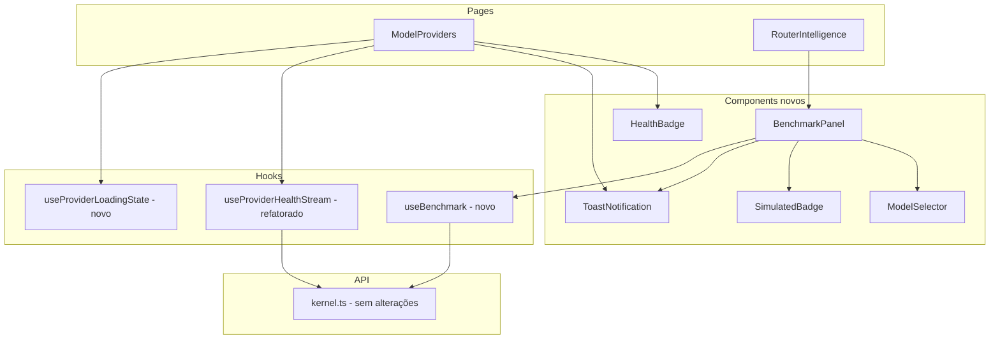

# Design Técnico — MVP04 Frontend

## Visão Geral

Este documento descreve o design técnico para completar o MVP04 do frontend do Andromeda SO. O escopo cobre sete áreas de melhoria na interface React existente, todas dentro das páginas `ModelProviders` e `RouterIntelligence`, sem alterações no backend.

As mudanças são cirúrgicas: novos componentes reutilizáveis (`HealthBadge`, `SimulatedBadge`, `ToastNotification`, `ModelSelector`, `BenchmarkPanel`) extraídos de código inline existente, e um hook refatorado (`useProviderHealthStream`) que passa a usar `setQueryData` em vez de `invalidateQueries`.

---

## Arquitetura

### Visão de alto nível



### Princípios de design

- **Sem alterações no backend**: todos os endpoints já existem e são consumidos como estão.
- **Sem re-fetch desnecessário**: eventos SSE atualizam o cache via `setQueryData`, não via `invalidateQueries`.
- **Estado de loading por provider**: cada linha da tabela rastreia seu próprio estado de loading independentemente.
- **Componentes atômicos**: `HealthBadge`, `SimulatedBadge` e `ToastNotification` são componentes puros sem efeitos colaterais.

---

## Componentes e Interfaces

### `HealthBadge`

Componente puro que renderiza o status de saúde de um provider com cor e latência.

```typescript
interface HealthBadgeProps {
  health?: string;       // 'ok' | 'warning' | 'error' | undefined
  latencyMs?: number;
}
```

Mapeamento de cores (classes Tailwind):
- `ok` → `text-emerald-400 border-emerald-400/60`
- `warning` → `text-yellow-400 border-yellow-400/60`
- `error` ou qualquer outro → `text-red-400 border-red-400/60`
- `undefined` → `text-slate-400 border-slate-400/40` + texto "Unknown"

Texto exibido: `"OK 120ms"`, `"Warning"`, `"Error"`, `"Unknown"`.

---

### `SimulatedBadge`

Componente puro, renderizado como `<span>` com estilo âmbar neon.

```typescript
// Sem props — é um badge estático
function SimulatedBadge(): JSX.Element
```

Classes: `border border-amber-400/70 text-amber-300 bg-amber-500/10 font-mono text-xs px-1 rounded`

---

### `ToastNotification`

Componente de notificação de erro com auto-dismiss configurável.

```typescript
interface ToastNotificationProps {
  message: string;
  onClose: () => void;
  durationMs?: number;  // padrão: 5000 (dentro do intervalo [4000, 8000])
}
```

- Usa `useEffect` com `setTimeout` para auto-dismiss.
- Botão de fechar chama `onClose` imediatamente.
- Estilo: `border border-red-500/70 bg-red-500/10 text-red-300` com ícone `✕`.
- Posicionamento: fixo no canto inferior direito (`fixed bottom-4 right-4`).

---

### `ModelSelector`

Componente de seleção de modelo para o `BenchmarkPanel`.

```typescript
interface ModelSelectorProps {
  models: Array<{ modelId: string; displayName: string; providerId: string }>;
  value: string | null;
  onChange: (modelId: string) => void;
}
```

- Quando `models` está vazio, renderiza mensagem de fallback em vez do `<select>`.
- Agrupa modelos por provider usando `<optgroup>` para melhor UX.

---

### `BenchmarkPanel`

Extração e refatoração do bloco de benchmark existente em `RouterIntelligence.tsx`.

```typescript
interface BenchmarkPanelProps {
  // sem props externas — consome hooks internamente
}
```

Estado interno:
```typescript
const [selectedModelId, setSelectedModelId] = useState<string | null>(null);
const [results, setResults] = useState<BenchmarkResultRow[]>([]);
const [error, setError] = useState<string | null>(null);
```

Onde `BenchmarkResultRow` estende `ModelBenchmark` com o campo `simulated`:
```typescript
interface BenchmarkResultRow {
  modelId: string;
  taskType: 'coding' | 'chat';
  score: number;
  latencyMs: number;
  simulated: boolean;
}
```

O painel usa o hook `useBenchmark` internamente e limita `results` a 10 itens.

---

### `useProviderHealthStream` (refatorado)

```typescript
// Antes:
source.addEventListener('health', () => {
  void queryClient.invalidateQueries({ queryKey: ['providers'] });
});

// Depois:
source.addEventListener('health', (event: MessageEvent) => {
  const data = JSON.parse(event.data) as { health: string; latencyMs?: number };
  queryClient.setQueryData<{ providers: Provider[] }>(['providers'], (old) => {
    if (!old) return old;
    return {
      providers: old.providers.map((p) =>
        p.id === providerId
          ? { ...p, health: data.health, latencyMs: data.latencyMs ?? p.latencyMs }
          : p
      )
    };
  });
});
```

O hook deve ser chamado para **todos os providers ativos**, não apenas o `activeProviderId`. A `ModelProviders` deve iterar sobre os providers e chamar o hook para cada um, ou o hook deve aceitar uma lista.

Solução: o hook aceita `providerId: string | null` (interface atual mantida) e `ModelProviders` chama `useProviderHealthStream` para cada provider via um componente auxiliar `HealthStreamSubscriber` (padrão render-nothing).

---

### `useProviderLoadingState`

Hook auxiliar para rastrear estado de loading por provider.

```typescript
function useProviderLoadingState(): {
  isLoading: (providerId: string) => boolean;
  setLoading: (providerId: string, loading: boolean) => void;
}
```

Implementado com `useState<Set<string>>` internamente. Permite que a tabela desabilite ambos os botões de um provider enquanto qualquer ação estiver em execução.

---

### `useBenchmark`

Hook que encapsula a mutação de benchmark.

```typescript
function useBenchmark(): {
  run: (modelId: string, taskType: 'coding' | 'chat') => Promise<BenchmarkResultRow>;
  isPending: boolean;
}
```

Usa `useMutation` do React Query internamente. Mapeia a resposta do endpoint para `BenchmarkResultRow`, incluindo o campo `simulated` (que já existe na resposta do backend mas não estava sendo usado).

---

## Modelos de Dados

### Extensão de `ModelBenchmark`

O tipo existente em `types/model.ts` precisa do campo `simulated`:

```typescript
// Antes:
export interface ModelBenchmark {
  modelId: string;
  taskType: 'coding' | 'chat';
  score: number;
  latencyMs: number;
}

// Depois:
export interface ModelBenchmark {
  modelId: string;
  taskType: 'coding' | 'chat';
  score: number;
  latencyMs: number;
  simulated?: boolean;  // campo adicionado
}
```

### Extensão de `Provider`

O tipo `Provider` precisa do campo `latencyMs` para que o `HealthBadge` possa exibir a latência em tempo real:

```typescript
// Antes:
export interface Provider {
  id: string;
  name: string;
  type: ProviderType;
  displayName?: string;
  baseUrl?: string;
  health: string;
  modelsCount: number;
  selectedModelIds?: string[];
}

// Depois:
export interface Provider {
  id: string;
  name: string;
  type: ProviderType;
  displayName?: string;
  baseUrl?: string;
  health: string;
  latencyMs?: number;   // campo adicionado
  modelsCount: number;
  selectedModelIds?: string[];
}
```

### `HealthEvent` (payload SSE)

```typescript
interface HealthEvent {
  health: 'ok' | 'warning' | 'error';
  latencyMs?: number;
}
```

### Modelos agregados para `ModelSelector`

```typescript
interface FlatCatalogModel {
  modelId: string;
  displayName: string;
  providerId: string;
  providerName: string;
}
```

O `BenchmarkPanel` agrega modelos de todos os providers via `useQuery` sobre `/api/providers` + catálogos individuais, ou usa os dados já em cache do React Query.

---

## Propriedades de Corretude

*Uma propriedade é uma característica ou comportamento que deve ser verdadeiro em todas as execuções válidas de um sistema — essencialmente, uma declaração formal sobre o que o sistema deve fazer. Propriedades servem como ponte entre especificações legíveis por humanos e garantias de corretude verificáveis por máquina.*

### Propriedade 1: Seletor populado com todos os modelos disponíveis

*Para qualquer* lista não-vazia de `CatalogModel`, o `BenchmarkPanel` deve renderizar um `<select>` contendo exatamente uma `<option>` para cada modelo da lista.

**Valida: Requisito 1.1**

---

### Propriedade 2: Chamada de benchmark usa o modelId selecionado

*Para qualquer* `CatalogModel` selecionado no `ModelSelector`, ao submeter o formulário de benchmark, a função `benchmarkModel` deve ser chamada com exatamente o `modelId` daquele modelo.

**Valida: Requisito 1.3**

---

### Propriedade 3: Resultado de benchmark inserido no topo da tabela

*Para qualquer* `BenchmarkResultRow` retornado com sucesso, ele deve aparecer na primeira posição da tabela de resultados após a conclusão do benchmark.

**Valida: Requisito 3.1**

---

### Propriedade 4: Tabela limitada a 10 resultados

*Para qualquer* quantidade N de benchmarks executados em sequência, a tabela deve exibir exatamente `min(N, 10)` linhas.

**Valida: Requisito 3.2**

---

### Propriedade 5: SimulatedBadge presente se e somente se simulated=true

*Para qualquer* `BenchmarkResultRow`, o `SimulatedBadge` deve estar presente na linha se e somente se `simulated === true`.

**Valida: Requisito 3.3**

---

### Propriedade 6: HealthBadge mapeia health para cor correta

*Para qualquer* valor de `health` (`'ok'`, `'warning'`, `'error'`, ou qualquer outro string), o `HealthBadge` deve aplicar a classe CSS correspondente à regra de mapeamento definida.

**Valida: Requisito 4.1**

---

### Propriedade 7: HealthBadge exibe latência para qualquer valor numérico

*Para qualquer* valor numérico de `latencyMs`, o texto renderizado pelo `HealthBadge` deve conter esse valor seguido de "ms".

**Valida: Requisito 4.2**

---

### Propriedade 8: HealthBadge presente em cada linha da ProvidersTable

*Para qualquer* lista de providers, a `ProvidersTable` deve renderizar exatamente um `HealthBadge` por linha.

**Valida: Requisito 4.4**

---

### Propriedade 9: useProviderHealthStream usa setQueryData, nunca invalidateQueries

*Para qualquer* sequência de eventos SSE recebidos, o hook `useProviderHealthStream` deve chamar `queryClient.setQueryData` para cada evento e nunca chamar `queryClient.invalidateQueries`.

**Valida: Requisito 5.1**

---

### Propriedade 10: useProviderHealthStream aplica health e latencyMs ao provider correto

*Para qualquer* `HealthEvent` com `providerId`, `health` e `latencyMs`, o hook deve atualizar no cache apenas o provider com aquele `id`, preservando todos os outros providers inalterados.

**Valida: Requisito 5.2, 5.3**

---

### Propriedade 11: Ambos os botões desabilitados durante qualquer ação por provider

*Para qualquer* provider com qualquer ação (Sync ou Test) em execução, ambos os botões "Sync" e "Test" daquele provider devem estar `disabled`.

**Valida: Requisito 6.4**

---

### Propriedade 12: ToastNotification desaparece dentro do intervalo [4000, 8000]ms

*Para qualquer* `ToastNotification` criada com `durationMs` dentro do intervalo `[4000, 8000]`, o componente deve ser removido do DOM após exatamente `durationMs` milissegundos sem interação do usuário.

**Valida: Requisito 7.4**

---

## Tratamento de Erros

### Erros de mutação (Sync, Test, Benchmark)

Todos os erros de mutação são capturados no `onError` do `useMutation` e armazenados em estado local (`useState<string | null>`). O componente pai renderiza um `ToastNotification` quando o estado de erro não é nulo. O `onClose` do toast limpa o estado.

Mensagem de fallback quando o backend não retorna mensagem legível:
- Sync: `"Falha ao sincronizar modelos."`
- Test: `"Falha ao verificar health."`
- Benchmark: `"Falha ao executar benchmark."`

Extração da mensagem de erro:
```typescript
const message = error instanceof Error ? error.message : fallback;
```

### Erros de SSE

Se o `EventSource` emitir um evento de erro, o hook `useProviderHealthStream` deve fechar a conexão e não tentar reconectar automaticamente (comportamento padrão do `EventSource` do browser é reconectar — o hook deve chamar `source.close()` no handler de erro para evitar reconexões infinitas em caso de provider inativo).

### Estado "Unknown" do HealthBadge

Quando `health` é `undefined` (provider recém-adicionado sem health check), o `HealthBadge` exibe "Unknown" com cor neutra. Isso não é um erro — é um estado válido inicial.

---

## Estratégia de Testes

### Abordagem dual

- **Testes de exemplo**: verificam comportamentos específicos, estados de loading, mensagens de erro e interações de UI.
- **Testes de propriedade**: verificam invariantes universais usando `@fast-check/vitest` (biblioteca de PBT para Vitest).

### Biblioteca de PBT

`@fast-check/vitest` — integração nativa com Vitest, sem configuração adicional. Cada teste de propriedade executa mínimo 100 iterações.

Tag de referência para cada teste de propriedade:
```
// Feature: mvp04-frontend, Property N: <texto da propriedade>
```

### Testes de exemplo (unitários)

Localizados em `frontend/src/components/__tests__/` e `frontend/src/hooks/__tests__/`.

Cobertura mínima por componente:
- `HealthBadge`: estado Unknown, estado ok/warning/error com latência
- `SimulatedBadge`: renderização do span com texto e classes corretas
- `ToastNotification`: auto-dismiss, fechar manualmente, estilo de erro
- `BenchmarkPanel`: estado loading, estado erro, estado sem modelos
- `ModelProviders` (integração): botões Sync/Test com loading por provider, toast de erro

### Testes de propriedade

Localizados nos mesmos diretórios `__tests__/`, com sufixo `.property.test.tsx`.

Propriedades a implementar (mapeadas para as 12 propriedades acima):
1. `BenchmarkPanel` — seletor populado (P1)
2. `BenchmarkPanel` — chamada com modelId correto (P2)
3. `BenchmarkPanel` — resultado no topo (P3)
4. `BenchmarkPanel` — limite de 10 resultados (P4)
5. `BenchmarkPanel` — SimulatedBadge condicional (P5)
6. `HealthBadge` — mapeamento de cor (P6)
7. `HealthBadge` — exibição de latência (P7)
8. `ProvidersTable` — HealthBadge por linha (P8)
9. `useProviderHealthStream` — setQueryData sem invalidate (P9)
10. `useProviderHealthStream` — atualização do provider correto (P10)
11. `ProvidersTable` — botões desabilitados durante ação (P11)
12. `ToastNotification` — auto-dismiss no intervalo correto (P12)

### Configuração de fake timers

Os testes de `ToastNotification` (P12 e exemplos de auto-dismiss) usam `vi.useFakeTimers()` para controlar o tempo sem esperar segundos reais.

### Estrutura de arquivos de teste

```
frontend/src/
├── components/
│   └── __tests__/
│       ├── HealthBadge.test.tsx
│       ├── HealthBadge.property.test.tsx
│       ├── SimulatedBadge.test.tsx
│       ├── ToastNotification.test.tsx
│       ├── ToastNotification.property.test.tsx
│       ├── BenchmarkPanel.test.tsx
│       └── BenchmarkPanel.property.test.tsx
└── hooks/
    └── __tests__/
        ├── useProviderHealthStream.test.ts
        └── useProviderHealthStream.property.test.ts
```
