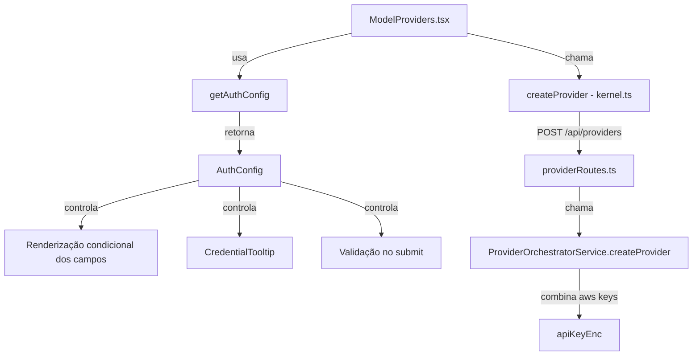

# Design Técnico — provider-auth-rules

## Visão Geral

Este design descreve as mudanças necessárias para substituir a função `getAuthMode` atual por um sistema de configuração de autenticação completo (`getAuthConfig`), suportando os 20 tipos de providers com regras distintas de exibição de campos, placeholders, tooltips e validação.

As mudanças abrangem:
- **Frontend**: novo tipo `AuthConfig`, função `getAuthConfig`, novos estados de formulário, renderização condicional, componente `CredentialTooltip`, validação no submit
- **Backend**: extensão de `ProviderConfig` com `accessKeyId`/`secretAccessKey`, lógica de combinação no `createProvider` para `aws-bedrock`

---

## Arquitetura



O fluxo é unidirecional: o `AuthConfig` retornado por `getAuthConfig` é a única fonte de verdade para o comportamento do formulário. Não há lógica de autenticação espalhada no componente — tudo deriva do config.

---

## Componentes e Interfaces

### 1. Tipos — `frontend/src/types/model.ts`

Adicionar ao arquivo existente:

```typescript
export type AuthMode =
  | 'none'
  | 'api-key'
  | 'api-key-baseurl'
  | 'oauth-apikey'
  | 'aws-credentials';

export type AuthConfig = {
  mode: AuthMode;
  apiKeyPlaceholder?: string;
  baseUrlPlaceholder?: string;
  baseUrlRequired: boolean;
  baseUrlVisible: boolean;
  credentialUrl?: string;
  hasOAuth: boolean;
};
```

Também estender `ProviderConfig`:

```typescript
export interface ProviderConfig {
  type: ProviderType;
  name?: string;
  apiKey?: string;
  baseUrl?: string;
  accessKeyId?: string;      // novo — aws-bedrock
  secretAccessKey?: string;  // novo — aws-bedrock
}
```

### 2. Função `getAuthConfig` — `frontend/src/utils/authConfig.ts`

Novo arquivo utilitário com o mapeamento completo dos 20 providers:

```typescript
import type { AuthConfig, ProviderType } from '../types/model';

export function getAuthConfig(type: ProviderType | string): AuthConfig {
  switch (type) {
    // ── Sem autenticação ──────────────────────────────────────────────
    case 'ollama':
      return {
        mode: 'none',
        baseUrlPlaceholder: 'http://127.0.0.1:11434',
        baseUrlRequired: false,
        baseUrlVisible: true,
        hasOAuth: false,
      };
    case 'lmstudio':
      return {
        mode: 'none',
        baseUrlPlaceholder: 'http://localhost:1234',
        baseUrlRequired: false,
        baseUrlVisible: true,
        hasOAuth: false,
      };
    case 'vllm':
      return {
        mode: 'none',
        baseUrlPlaceholder: 'http://localhost:8000',
        baseUrlRequired: true,
        baseUrlVisible: true,
        hasOAuth: false,
      };

    // ── API Key simples ───────────────────────────────────────────────
    case 'anthropic':
      return {
        mode: 'api-key',
        apiKeyPlaceholder: 'sk-ant-...',
        baseUrlRequired: false,
        baseUrlVisible: false,
        credentialUrl: 'https://console.anthropic.com/settings/keys',
        hasOAuth: false,
      };
    case 'groq':
      return {
        mode: 'api-key',
        apiKeyPlaceholder: 'gsk_...',
        baseUrlRequired: false,
        baseUrlVisible: false,
        credentialUrl: 'https://console.groq.com/keys',
        hasOAuth: false,
      };
    case 'mistral':
      return {
        mode: 'api-key',
        apiKeyPlaceholder: 'API Key',
        baseUrlRequired: false,
        baseUrlVisible: false,
        credentialUrl: 'https://console.mistral.ai/api-keys/',
        hasOAuth: false,
      };
    case 'together':
      return {
        mode: 'api-key',
        apiKeyPlaceholder: 'API Key',
        baseUrlRequired: false,
        baseUrlVisible: false,
        credentialUrl: 'https://api.together.xyz/settings/api-keys',
        hasOAuth: false,
      };
    case 'fireworks':
      return {
        mode: 'api-key',
        apiKeyPlaceholder: 'API Key',
        baseUrlRequired: false,
        baseUrlVisible: false,
        credentialUrl: 'https://fireworks.ai/account/api-keys',
        hasOAuth: false,
      };
    case 'deepinfra':
      return {
        mode: 'api-key',
        apiKeyPlaceholder: 'API Key',
        baseUrlRequired: false,
        baseUrlVisible: false,
        credentialUrl: 'https://deepinfra.com/dash/api_keys',
        hasOAuth: false,
      };
    case 'novita':
      return {
        mode: 'api-key',
        apiKeyPlaceholder: 'API Key',
        baseUrlRequired: false,
        baseUrlVisible: false,
        credentialUrl: 'https://novita.ai/settings/key-management',
        hasOAuth: false,
      };
    case 'openrouter':
      return {
        mode: 'api-key',
        apiKeyPlaceholder: 'sk-or-...',
        baseUrlRequired: false,
        baseUrlVisible: false,
        credentialUrl: 'https://openrouter.ai/keys',
        hasOAuth: false,
      };
    case 'hyperbolic':
      return {
        mode: 'api-key',
        apiKeyPlaceholder: 'API Key',
        baseUrlRequired: false,
        baseUrlVisible: false,
        credentialUrl: 'https://app.hyperbolic.xyz/settings',
        hasOAuth: false,
      };
    case 'replicate':
      return {
        mode: 'api-key',
        apiKeyPlaceholder: 'r8_...',
        baseUrlRequired: false,
        baseUrlVisible: false,
        credentialUrl: 'https://replicate.com/account/api-tokens',
        hasOAuth: false,
      };
    case 'cohere':
      return {
        mode: 'api-key',
        apiKeyPlaceholder: 'API Key',
        baseUrlRequired: false,
        baseUrlVisible: false,
        credentialUrl: 'https://dashboard.cohere.com/api-keys',
        hasOAuth: false,
      };
    case 'xai':
      return {
        mode: 'api-key',
        apiKeyPlaceholder: 'xai-...',
        baseUrlRequired: false,
        baseUrlVisible: false,
        credentialUrl: 'https://console.x.ai/',
        hasOAuth: false,
      };

    // ── API Key + BaseUrl obrigatória ─────────────────────────────────
    case 'azure-openai':
      return {
        mode: 'api-key-baseurl',
        apiKeyPlaceholder: 'API Key',
        baseUrlPlaceholder: 'https://meu-recurso.openai.azure.com/',
        baseUrlRequired: true,
        baseUrlVisible: true,
        credentialUrl: 'https://portal.azure.com/#view/Microsoft_Azure_ProjectOxford/CognitiveServicesHub/~/OpenAI',
        hasOAuth: false,
      };
    case 'google-vertex':
      return {
        mode: 'api-key-baseurl',
        apiKeyPlaceholder: 'API Key',
        baseUrlPlaceholder: 'https://us-central1-aiplatform.googleapis.com/',
        baseUrlRequired: true,
        baseUrlVisible: true,
        credentialUrl: 'https://console.cloud.google.com/apis/credentials',
        hasOAuth: false,
      };

    // ── OAuth + API Key ───────────────────────────────────────────────
    case 'openai':
      return {
        mode: 'oauth-apikey',
        apiKeyPlaceholder: 'sk-...',
        baseUrlRequired: false,
        baseUrlVisible: false,
        credentialUrl: 'https://platform.openai.com/api-keys',
        hasOAuth: true,
      };
    case 'google':
      return {
        mode: 'oauth-apikey',
        apiKeyPlaceholder: 'API Key',
        baseUrlRequired: false,
        baseUrlVisible: false,
        credentialUrl: 'https://aistudio.google.com/app/apikey',
        hasOAuth: true,
      };

    // ── AWS Credentials ───────────────────────────────────────────────
    case 'aws-bedrock':
      return {
        mode: 'aws-credentials',
        baseUrlRequired: false,
        baseUrlVisible: false,
        credentialUrl: 'https://console.aws.amazon.com/iam/home#/security_credentials',
        hasOAuth: false,
      };

    // ── Fallback seguro ───────────────────────────────────────────────
    default:
      return {
        mode: 'api-key',
        apiKeyPlaceholder: 'API Key',
        baseUrlRequired: false,
        baseUrlVisible: false,
        hasOAuth: false,
      };
  }
}
```

### 3. Componente `CredentialTooltip` — `frontend/src/components/CredentialTooltip.tsx`

```typescript
interface CredentialTooltipProps {
  url: string;
}

export function CredentialTooltip({ url }: CredentialTooltipProps) {
  return (
    <a
      href={url}
      target="_blank"
      rel="noopener noreferrer"
      title="Obter credenciais"
      className="ml-1 inline-flex items-center justify-center rounded-full border border-cyan-500/40 bg-slate-900/60 px-1.5 py-0.5 font-mono text-xs text-cyan-400 hover:border-cyan-400 hover:text-cyan-200"
    >
      ?
    </a>
  );
}
```

### 4. Novos estados no formulário — `frontend/src/pages/ModelProviders.tsx`

Adicionar ao estado do componente:

```typescript
const [accessKeyId, setAccessKeyId] = useState('');
const [secretAccessKey, setSecretAccessKey] = useState('');
```

Atualizar o handler de troca de provider para limpar todos os campos:

```typescript
onChange={(e) => {
  const v = e.target.value as ProviderType;
  setProviderType(v);
  setName(v);
  setApiKey('');
  setBaseUrl('');
  setAccessKeyId('');
  setSecretAccessKey('');
}}
```

### 5. Renderização condicional dos campos

Substituir a lógica atual de renderização por blocos baseados em `authConfig`:

```typescript
const authConfig = getAuthConfig(providerType);

// Campo API Key — visível para api-key, api-key-baseurl, oauth-apikey
{(authConfig.mode === 'api-key' || authConfig.mode === 'api-key-baseurl' || authConfig.mode === 'oauth-apikey') && (
  <div className="flex items-center gap-1">
    <input
      value={apiKey}
      onChange={(e) => setApiKey(e.target.value)}
      className="rounded bg-slate-900/80 p-2 font-mono"
      placeholder={authConfig.apiKeyPlaceholder ?? 'API Key'}
    />
    {authConfig.credentialUrl && <CredentialTooltip url={authConfig.credentialUrl} />}
  </div>
)}

// Campos AWS — visível apenas para aws-credentials
{authConfig.mode === 'aws-credentials' && (
  <>
    <div className="flex items-center gap-1">
      <input
        value={accessKeyId}
        onChange={(e) => setAccessKeyId(e.target.value)}
        className="rounded bg-slate-900/80 p-2 font-mono"
        placeholder="AKIA..."
      />
      {authConfig.credentialUrl && <CredentialTooltip url={authConfig.credentialUrl} />}
    </div>
    <input
      value={secretAccessKey}
      onChange={(e) => setSecretAccessKey(e.target.value)}
      className="rounded bg-slate-900/80 p-2 font-mono"
      placeholder="wJalrXUtnFEMI..."
    />
  </>
)}

// Botão OAuth — visível para oauth-apikey
{authConfig.hasOAuth && providerType === 'openai' && (
  <button type="button" onClick={() => void startOAuthFlow()} ...>
    Login com OpenAI
  </button>
)}
{authConfig.hasOAuth && providerType === 'google' && (
  <button type="button" onClick={() => void startGoogleOAuthFlow()} ...>
    Login com Google
  </button>
)}

// Campo BaseUrl — visível quando baseUrlVisible === true
{authConfig.baseUrlVisible && (
  <input
    value={baseUrl}
    onChange={(e) => setBaseUrl(e.target.value)}
    className="rounded bg-slate-900/80 p-2 font-mono"
    placeholder={authConfig.baseUrlPlaceholder ?? 'Base URL'}
    required={authConfig.baseUrlRequired}
  />
)}
```

### 6. Validação no submit

```typescript
const addProvider = async (event: FormEvent) => {
  event.preventDefault();

  // Validação: baseUrl obrigatória para api-key-baseurl e vllm
  if (authConfig.baseUrlRequired && !baseUrl.trim()) {
    setSyncError('Base URL é obrigatória para este provider.');
    return;
  }

  // Validação: credenciais AWS obrigatórias
  if (authConfig.mode === 'aws-credentials') {
    if (!accessKeyId.trim()) {
      setSyncError('Access Key ID é obrigatório para AWS Bedrock.');
      return;
    }
    if (!secretAccessKey.trim()) {
      setSyncError('Secret Access Key é obrigatório para AWS Bedrock.');
      return;
    }
  }

  const created = await createProviderMutation.mutateAsync({
    type: providerType,
    name,
    apiKey: apiKey || undefined,
    baseUrl: baseUrl || undefined,
    accessKeyId: accessKeyId || undefined,
    secretAccessKey: secretAccessKey || undefined,
  });
  setActiveProviderId(created.id);
};
```

---

## Modelos de Dados

### Backend — `core/kernel/src/modules/providers/domain/entities/provider.entity.ts`

Estender `ProviderConfig`:

```typescript
export type ProviderConfig = {
  type: ProviderType;
  name?: string;
  apiKey?: string;
  baseUrl?: string;
  accessKeyId?: string;      // novo
  secretAccessKey?: string;  // novo
};
```

### Backend — `ProviderOrchestratorService.createProvider`

Adicionar lógica de combinação para `aws-bedrock`:

```typescript
async createProvider(config: ProviderConfig): Promise<Provider> {
  const normalizedName = (config.name || config.type).trim().toLowerCase();
  const existing = await this.repository.findByName(normalizedName);
  if (existing) {
    throw new Error('Provider already exists');
  }

  // Para aws-bedrock, combinar accessKeyId e secretAccessKey em apiKeyEnc
  let resolvedApiKey = config.apiKey;
  if (config.type === 'aws-bedrock' && config.accessKeyId && config.secretAccessKey) {
    resolvedApiKey = `${config.accessKeyId}:${config.secretAccessKey}`;
  }

  const provider: Provider = {
    id: randomUUID(),
    name: normalizedName,
    type: config.type,
    apiKeyEnc: resolvedApiKey
      ? Buffer.from(resolvedApiKey, 'utf-8').toString('base64')
      : undefined,
    baseUrl: config.baseUrl,
    health: 'warning',
    createdAt: new Date().toISOString(),
    selectedModelIds: []
  };

  await this.repository.create(provider);
  return provider;
}
```

O formato `accessKeyId:secretAccessKey` permite decodificação posterior via `split(':')` no adapter AWS Bedrock.

---

## Propriedades de Correção

*Uma propriedade é uma característica ou comportamento que deve ser verdadeiro em todas as execuções válidas de um sistema — essencialmente, uma declaração formal sobre o que o sistema deve fazer. Propriedades servem como ponte entre especificações legíveis por humanos e garantias de correção verificáveis por máquina.*

### Propriedade 1: Mapeamento completo de AuthMode por grupo

*Para qualquer* provider pertencente a um grupo de AuthMode definido (none, api-key, api-key-baseurl, oauth-apikey, aws-credentials), `getAuthConfig(provider).mode` deve retornar exatamente o AuthMode esperado para aquele grupo.

**Valida: Requisitos 1.1, 1.2, 1.3, 1.4, 1.5**

### Propriedade 2: Fallback seguro para providers desconhecidos

*Para qualquer* string que não corresponda a um `ProviderType` reconhecido, `getAuthConfig` deve retornar um objeto com `mode === 'api-key'`, garantindo que o formulário nunca fique em estado inválido.

**Valida: Requisito 1.6**

### Propriedade 3: Placeholders corretos por provider

*Para qualquer* provider com placeholder definido no mapeamento, `getAuthConfig(provider).apiKeyPlaceholder` deve retornar exatamente o valor especificado (ex: `'sk-ant-...'` para anthropic, `'gsk_...'` para groq).

**Valida: Requisitos 3.1, 3.2, 3.3, 3.4, 3.5, 3.6, 3.8, 3.9**

### Propriedade 4: credentialUrl presente para todos os providers com autenticação

*Para qualquer* provider cujo `AuthMode` não seja `none`, `getAuthConfig(provider).credentialUrl` deve ser uma string não-vazia (URL válida).

**Valida: Requisitos 4.1, 4.3**

### Propriedade 5: Validação de baseUrl obrigatória

*Para qualquer* provider com `authConfig.baseUrlRequired === true`, tentar submeter o formulário com `baseUrl` vazia deve resultar em erro de validação, sem chamar `createProvider`.

**Valida: Requisitos 2.8, 7.3, 7.5**

### Propriedade 6: Combinação AWS round-trip

*Para qualquer* par `(accessKeyId, secretAccessKey)` não-vazio, a combinação `accessKeyId:secretAccessKey` codificada em base64 deve ser decodificável de volta aos valores originais via `split(':')`.

**Valida: Requisito 5.3**

---

## Tratamento de Erros

| Situação | Comportamento |
|---|---|
| `baseUrl` vazia com `baseUrlRequired === true` | Exibe mensagem via `setSyncError`, bloqueia submit |
| `accessKeyId` vazio com `aws-credentials` | Exibe mensagem via `setSyncError`, bloqueia submit |
| `secretAccessKey` vazio com `aws-credentials` | Exibe mensagem via `setSyncError`, bloqueia submit |
| `VITE_GOOGLE_CLIENT_ID` ausente | Botão OAuth Google desabilitado com mensagem |
| Provider já existente (409 do backend) | Exibe erro via `setSyncError` (comportamento já existente) |
| `ProviderType` desconhecido em `getAuthConfig` | Retorna fallback `api-key` silenciosamente |

---

## Estratégia de Testes

### Testes unitários (Vitest)

**`frontend/src/utils/__tests__/authConfig.test.ts`**
- Verificar que cada um dos 20 providers retorna o `AuthMode` correto
- Verificar placeholders específicos (anthropic, groq, openai, openrouter, replicate, xai, aws-bedrock, azure-openai)
- Verificar que todos os providers com auth têm `credentialUrl` definida
- Verificar fallback para tipo desconhecido

**`frontend/src/pages/__tests__/ModelProviders.test.tsx`**
- Renderização condicional: campos corretos aparecem/somem ao trocar provider
- Validação no submit: erro ao submeter azure-openai sem baseUrl
- Validação no submit: erro ao submeter aws-bedrock sem accessKeyId ou secretAccessKey
- Reset de campos ao trocar provider

**`core/kernel/src/modules/providers/__tests__/providerOrchestratorService.test.ts`** (existente)
- Adicionar caso: `createProvider` com `aws-bedrock` + `accessKeyId` + `secretAccessKey` deve gerar `apiKeyEnc` decodificável

### Testes de propriedade (Vitest + fast-check)

Usar `fast-check` para os testes de propriedade:

```typescript
// Propriedade 1: Mapeamento de AuthMode
it.each([
  [['ollama', 'lmstudio', 'vllm'], 'none'],
  [['anthropic', 'groq', 'mistral', 'together', 'fireworks', 'deepinfra', 'novita', 'openrouter', 'hyperbolic', 'replicate', 'cohere', 'xai'], 'api-key'],
  [['azure-openai', 'google-vertex'], 'api-key-baseurl'],
  [['openai', 'google'], 'oauth-apikey'],
  [['aws-bedrock'], 'aws-credentials'],
])('providers %s devem ter mode %s', (providers, expectedMode) => {
  providers.forEach(p => {
    expect(getAuthConfig(p as ProviderType).mode).toBe(expectedMode);
  });
});

// Propriedade 2: Fallback
fc.assert(fc.property(
  fc.string().filter(s => !PROVIDER_OPTIONS.includes(s as ProviderType)),
  (unknownType) => getAuthConfig(unknownType).mode === 'api-key'
), { numRuns: 100 });

// Propriedade 6: AWS round-trip
fc.assert(fc.property(
  fc.string({ minLength: 1 }).filter(s => !s.includes(':')),
  fc.string({ minLength: 1 }).filter(s => !s.includes(':')),
  (accessKeyId, secretAccessKey) => {
    const combined = `${accessKeyId}:${secretAccessKey}`;
    const encoded = Buffer.from(combined, 'utf-8').toString('base64');
    const decoded = Buffer.from(encoded, 'base64').toString('utf-8');
    const [decodedKey, decodedSecret] = decoded.split(':');
    return decodedKey === accessKeyId && decodedSecret === secretAccessKey;
  }
), { numRuns: 100 });
```

Cada teste de propriedade deve rodar com mínimo de 100 iterações.
Tag de referência: `Feature: provider-auth-rules, Property {N}: {texto}`
