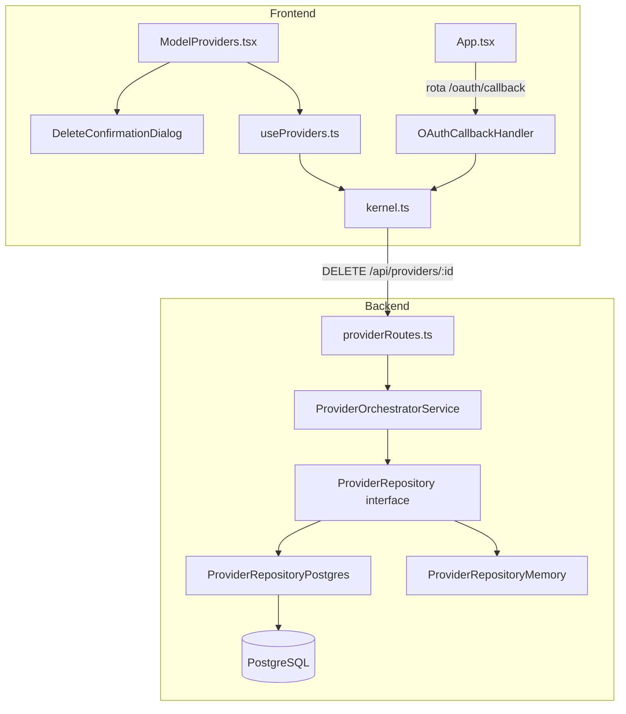
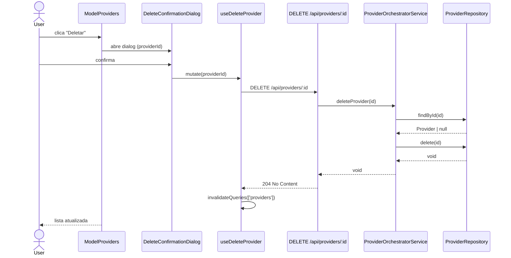
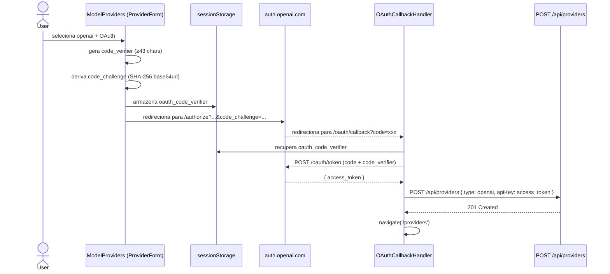

# Design Técnico — provider-management-v2

## Visão Geral

Este documento descreve o design técnico para duas features do Andromeda SO:

1. **Deletar Provider** — endpoint `DELETE /api/providers/:id`, método `delete` no repositório, botão de exclusão com confirmação na UI.
2. **Autenticação OpenAI com OAuth 2.0 + PKCE** — detecção automática do modo de autenticação no formulário, fluxo OAuth com PKCE, componente `OAuthCallbackHandler` e rota `/oauth/callback`.

O sistema já possui `ON DELETE CASCADE` configurado em `provider_model_catalog`, portanto a remoção em cascata do catálogo é garantida pelo banco sem lógica adicional na aplicação.

---

## Arquitetura



### Fluxo de Exclusão



### Fluxo OAuth 2.0 com PKCE



---

## Componentes e Interfaces

### Backend

#### `ProviderRepository` (interface)

Adicionar o método `delete` à interface existente:

```typescript
// core/kernel/src/modules/providers/domain/repositories/provider.repository.ts
export interface ProviderRepository {
  // ... métodos existentes ...
  delete(id: string): Promise<void>;
}
```

#### `ProviderRepositoryPostgres`

```typescript
async delete(id: string): Promise<void> {
  await this.ensureInitialized();
  const result = await this.pool.query(
    'DELETE FROM provider_state WHERE id = $1',
    [id]
  );
  if (result.rowCount === 0) {
    throw new Error('Provider not found');
  }
}
```

A remoção em cascata dos registros em `provider_model_catalog` é garantida pela constraint `ON DELETE CASCADE` já existente no schema.

#### `ProviderRepositoryMemory`

```typescript
async delete(id: string): Promise<void> {
  const provider = this.providers.get(id);
  if (!provider) {
    throw new Error('Provider not found');
  }
  this.providers.delete(id);
  this.providersByName.delete(provider.name);
  this.catalogs.delete(id);
}
```

#### `ProviderOrchestratorService`

```typescript
async deleteProvider(id: string): Promise<void> {
  const provider = await this.repository.findById(id);
  if (!provider) {
    throw new Error('Provider not found');
  }
  await this.repository.delete(id);
}
```

#### `providerRoutes.ts` — nova rota DELETE

```typescript
server.delete('/:id', async function handleDelete(request, reply) {
  const providerOrchestratorService = await getProviderOrchestratorService();
  const { id } = request.params as { id: string };
  try {
    await providerOrchestratorService.deleteProvider(id);
    return reply.status(204).send();
  } catch (error) {
    return reply.status(404).send({ error: (error as Error).message });
  }
});
```

### Frontend

#### `kernel.ts` — nova função `deleteProvider`

```typescript
export async function deleteProvider(id: string): Promise<void> {
  const response = await fetch(`/api/providers/${encodeURIComponent(id)}`, {
    method: 'DELETE'
  });
  if (!response.ok) {
    const body = await response.json() as { error?: string };
    throw new Error(body.error ?? `Delete failed: ${response.status}`);
  }
}
```

#### `useProviders.ts` — novo hook `useDeleteProvider`

```typescript
export function useDeleteProvider() {
  const queryClient = useQueryClient();
  return useMutation({
    mutationFn: (id: string) => deleteProvider(id),
    onSuccess: () => {
      void queryClient.invalidateQueries({ queryKey: ['providers'] });
    }
  });
}
```

#### `DeleteConfirmationDialog` — componente modal

```typescript
// frontend/src/components/DeleteConfirmationDialog.tsx
interface DeleteConfirmationDialogProps {
  providerName: string;
  onConfirm: () => void;
  onCancel: () => void;
  isDeleting: boolean;
}

export function DeleteConfirmationDialog({
  providerName,
  onConfirm,
  onCancel,
  isDeleting
}: DeleteConfirmationDialogProps) {
  return (
    <div className="fixed inset-0 z-50 flex items-center justify-center bg-black/60">
      <div className="rounded-xl border border-red-500/40 bg-slate-900 p-6 shadow-xl">
        <p className="font-mono text-white">
          Deletar provider <span className="text-red-400">"{providerName}"</span>?
        </p>
        <p className="mt-1 font-mono text-sm text-slate-400">
          Esta ação removerá o provider e todos os modelos do catálogo associados.
        </p>
        <div className="mt-4 flex justify-end gap-3">
          <button
            onClick={onCancel}
            disabled={isDeleting}
            className="rounded border border-slate-500/50 px-4 py-1 font-mono text-sm"
          >
            Cancelar
          </button>
          <button
            onClick={onConfirm}
            disabled={isDeleting}
            className="rounded border border-red-500/50 bg-red-500/20 px-4 py-1 font-mono text-sm text-red-300 disabled:opacity-50"
          >
            {isDeleting ? 'Deletando...' : 'Confirmar'}
          </button>
        </div>
      </div>
    </div>
  );
}
```

#### `ModelProviders.tsx` — integração do botão Delete

Adicionar ao estado do componente:

```typescript
const [deleteTarget, setDeleteTarget] = useState<Provider | null>(null);
const deleteProviderMutation = useDeleteProvider();
```

Adicionar handler:

```typescript
const confirmDelete = async () => {
  if (!deleteTarget) return;
  await deleteProviderMutation.mutateAsync(deleteTarget.id);
  setDeleteTarget(null);
};
```

Adicionar botão na coluna Actions de cada linha:

```tsx
<button
  className="rounded border border-red-500/50 px-2 text-red-400 disabled:opacity-50"
  disabled={deleteProviderMutation.isPending && deleteTarget?.id === provider.id}
  onClick={() => setDeleteTarget(provider)}
>
  Deletar
</button>
```

Renderizar o dialog condicionalmente:

```tsx
{deleteTarget && (
  <DeleteConfirmationDialog
    providerName={deleteTarget.name}
    onConfirm={() => void confirmDelete()}
    onCancel={() => setDeleteTarget(null)}
    isDeleting={deleteProviderMutation.isPending}
  />
)}
```

#### Detecção de tipo de provider no formulário

Adicionar estado e lógica de detecção em `ModelProviders.tsx`:

```typescript
type AuthMode = 'api-key' | 'oauth' | 'none';

const getAuthMode = (type: ProviderType): AuthMode[] => {
  if (type === 'openai') return ['api-key', 'oauth'];
  if (type === 'ollama' || type === 'lmstudio' || type === 'vllm') return ['none'];
  return ['api-key'];
};

const [authMode, setAuthMode] = useState<AuthMode>('api-key');

// Resetar ao mudar tipo
const handleProviderTypeChange = (v: ProviderType) => {
  setProviderType(v);
  setName(v);
  setApiKey('');
  const modes = getAuthMode(v);
  setAuthMode(modes[0]);
};
```

Renderização condicional dos campos de autenticação:

```tsx
{/* Apenas para openai: seletor de modo */}
{providerType === 'openai' && (
  <div className="flex gap-2">
    <button
      type="button"
      onClick={() => setAuthMode('api-key')}
      className={authMode === 'api-key' ? 'border-cyan-300 ...' : '...'}
    >
      API Key
    </button>
    <button
      type="button"
      onClick={() => setAuthMode('oauth')}
      className={authMode === 'oauth' ? 'border-cyan-300 ...' : '...'}
    >
      Login com OpenAI (OAuth)
    </button>
  </div>
)}

{/* Campo API Key: openai em modo api-key, ou qualquer outro tipo que não seja 'none' */}
{authMode === 'api-key' && (
  <input
    value={apiKey}
    onChange={(e) => setApiKey(e.target.value)}
    placeholder="API Key"
    className="rounded bg-slate-900/80 p-2 font-mono"
  />
)}

{/* Botão OAuth: apenas openai em modo oauth */}
{providerType === 'openai' && authMode === 'oauth' && (
  <button type="button" onClick={startOAuthFlow} className="...">
    Login com OpenAI
  </button>
)}
```

#### Função `startOAuthFlow` (em `ModelProviders.tsx`)

```typescript
const startOAuthFlow = () => {
  const verifier = generateCodeVerifier();        // ≥43 chars aleatórios
  const challenge = generateCodeChallenge(verifier); // SHA-256 base64url
  sessionStorage.setItem('oauth_code_verifier', verifier);

  const clientId = import.meta.env.VITE_OPENAI_OAUTH_CLIENT_ID as string;
  const params = new URLSearchParams({
    response_type: 'code',
    client_id: clientId,
    redirect_uri: 'http://localhost:5173/oauth/callback',
    scope: 'openid email profile offline_access',
    code_challenge: challenge,
    code_challenge_method: 'S256'
  });
  window.location.href = `https://auth.openai.com/authorize?${params.toString()}`;
};
```

Funções utilitárias PKCE (em `frontend/src/utils/pkce.ts`):

```typescript
export function generateCodeVerifier(): string {
  const array = new Uint8Array(48); // 48 bytes → 64 chars base64url ≥ 43
  crypto.getRandomValues(array);
  return base64urlEncode(array);
}

export async function generateCodeChallenge(verifier: string): Promise<string> {
  const encoder = new TextEncoder();
  const data = encoder.encode(verifier);
  const digest = await crypto.subtle.digest('SHA-256', data);
  return base64urlEncode(new Uint8Array(digest));
}

function base64urlEncode(buffer: Uint8Array): string {
  return btoa(String.fromCharCode(...buffer))
    .replace(/\+/g, '-')
    .replace(/\//g, '_')
    .replace(/=/g, '');
}
```

> Nota: `generateCodeChallenge` é assíncrona por usar `crypto.subtle`. O `startOAuthFlow` deve ser `async` e aguardar o challenge antes de redirecionar.

#### `OAuthCallbackHandler` — componente

```typescript
// frontend/src/pages/OAuthCallbackHandler.tsx
import { useEffect, useState } from 'react';
import { useNavigate } from 'react-router-dom';
import { createProvider } from '../api/kernel';

export function OAuthCallbackHandler() {
  const navigate = useNavigate();
  const [error, setError] = useState<string | null>(null);

  useEffect(() => {
    const run = async () => {
      const params = new URLSearchParams(window.location.search);
      const code = params.get('code');

      if (!code) {
        setError('Autorização cancelada ou código ausente.');
        return;
      }

      const verifier = sessionStorage.getItem('oauth_code_verifier');
      if (!verifier) {
        setError('Sessão OAuth expirada. Tente novamente.');
        return;
      }

      try {
        const tokenRes = await fetch('https://auth.openai.com/oauth/token', {
          method: 'POST',
          headers: { 'Content-Type': 'application/x-www-form-urlencoded' },
          body: new URLSearchParams({
            grant_type: 'authorization_code',
            code,
            redirect_uri: 'http://localhost:5173/oauth/callback',
            client_id: import.meta.env.VITE_OPENAI_OAUTH_CLIENT_ID as string,
            code_verifier: verifier
          })
        });

        if (!tokenRes.ok) {
          const body = await tokenRes.json() as { error_description?: string };
          setError(body.error_description ?? 'Falha ao obter token OAuth.');
          return;
        }

        const { access_token } = await tokenRes.json() as { access_token: string };
        sessionStorage.removeItem('oauth_code_verifier');

        await createProvider({ type: 'openai', name: 'openai', apiKey: access_token });
        navigate('/providers');
      } catch (err) {
        setError(err instanceof Error ? err.message : 'Erro desconhecido no fluxo OAuth.');
      }
    };

    void run();
  }, [navigate]);

  if (error) {
    return (
      <div className="flex min-h-screen items-center justify-center bg-slate-950 font-mono text-red-400">
        <p>Erro OAuth: {error}</p>
      </div>
    );
  }

  return (
    <div className="flex min-h-screen items-center justify-center bg-slate-950 font-mono text-cyan-300">
      <p>Processando autenticação OpenAI...</p>
    </div>
  );
}
```

> **Nota de roteamento**: O `App.tsx` atual usa tabs com `useState`, não `react-router-dom`. Para suportar a rota `/oauth/callback`, será necessário introduzir `react-router-dom` (ou `BrowserRouter`) no `App.tsx`. A rota `/providers` pode ser mapeada para a tab `models` existente.

#### `App.tsx` — adição da rota `/oauth/callback`

```tsx
// Adicionar import
import { BrowserRouter, Routes, Route } from 'react-router-dom';
import { OAuthCallbackHandler } from './pages/OAuthCallbackHandler';

// Envolver o App com BrowserRouter e adicionar rota dedicada
function App() {
  return (
    <BrowserRouter>
      <Routes>
        <Route path="/oauth/callback" element={<OAuthCallbackHandler />} />
        <Route path="*" element={<MainApp />} />
      </Routes>
    </BrowserRouter>
  );
}
```

O conteúdo atual do `App` é extraído para um componente `MainApp` interno.

#### Variável de ambiente `VITE_OPENAI_OAUTH_CLIENT_ID`

Adicionar ao `frontend/.env.example` (e ao `.env` local para desenvolvimento):

```env
VITE_OPENAI_OAUTH_CLIENT_ID=your-openai-oauth-client-id
```

O Vite expõe automaticamente variáveis prefixadas com `VITE_` via `import.meta.env`.

---

## Modelos de Dados

### Entidade `Provider` (sem alterações)

```typescript
interface Provider {
  id: string;
  name: string;
  type: ProviderType;
  apiKeyEnc?: string;   // base64 do token (API Key ou access_token OAuth)
  baseUrl?: string;
  health: string;
  createdAt: string;
  selectedModelIds: string[];
}
```

O campo `apiKeyEnc` é reutilizado para armazenar tanto API Keys estáticas quanto `access_token` OAuth — ambos são codificados em base64 pelo `ProviderOrchestratorService.createProvider`.

### Schema PostgreSQL (sem alterações de schema)

A tabela `provider_state` e a constraint `ON DELETE CASCADE` em `provider_model_catalog` já suportam a exclusão em cascata. Nenhuma migration é necessária.

### Estado do formulário frontend

```typescript
type AuthMode = 'api-key' | 'oauth' | 'none';

// Novos estados em ModelProviders
const [authMode, setAuthMode] = useState<AuthMode>('api-key');
const [deleteTarget, setDeleteTarget] = useState<Provider | null>(null);
```

---

## Propriedades de Correção

*Uma propriedade é uma característica ou comportamento que deve ser verdadeiro em todas as execuções válidas de um sistema — essencialmente, uma declaração formal sobre o que o sistema deve fazer. Propriedades servem como ponte entre especificações legíveis por humanos e garantias de correção verificáveis por máquinas.*

### Propriedade 1: Delete remove o provider do repositório

*Para qualquer* provider criado e persistido no repositório, após chamar `delete(id)`, uma chamada subsequente a `findById(id)` deve retornar `null`.

**Valida: Requisito 1.1, 1.4**

---

### Propriedade 2: Codificação base64 de API Key é reversível

*Para qualquer* string não vazia fornecida como `apiKey` ao criar um provider, o valor armazenado em `apiKeyEnc` deve ser o base64 da string original, e `Buffer.from(apiKeyEnc, 'base64').toString('utf-8')` deve retornar o valor original.

**Valida: Requisito 4.2**

---

### Propriedade 3: Geração de PKCE produz code_verifier válido

*Para qualquer* execução de `generateCodeVerifier()`, o resultado deve ter comprimento mínimo de 43 caracteres e conter apenas caracteres do alfabeto base64url (`[A-Za-z0-9\-_]`).

**Valida: Requisito 5.1**

---

### Propriedade 4: code_challenge é SHA-256 base64url do code_verifier

*Para qualquer* `code_verifier` gerado, `generateCodeChallenge(verifier)` deve produzir exatamente o SHA-256 do verifier codificado em base64url, sem padding.

**Valida: Requisito 5.1**

---

### Propriedade 5: code_verifier é persistido no sessionStorage

*Para qualquer* execução do fluxo OAuth iniciado pelo `ProviderForm`, o `code_verifier` gerado deve estar disponível em `sessionStorage.getItem('oauth_code_verifier')` imediatamente após a geração.

**Valida: Requisito 5.7**

---

### Propriedade 6: Formulário exibe apenas API Key para tipos não-openai e não-ollama

*Para qualquer* tipo de provider que não seja `openai`, `ollama`, `lmstudio` ou `vllm`, o formulário deve renderizar exatamente um campo de API Key e nenhum botão OAuth.

**Valida: Requisito 3.2**

---

### Propriedade 7: Mudança de tipo reseta credenciais

*Para qualquer* sequência de mudança de `providerType` no formulário, após a mudança o campo `apiKey` deve estar vazio e `authMode` deve ser o modo padrão para o novo tipo.

**Valida: Requisito 3.4**

---

### Propriedade 8: Botão Deletar desabilitado durante exclusão em andamento

*Para qualquer* provider com exclusão em andamento (`isPending === true` para aquele `id`), o botão "Deletar" correspondente na tabela deve ter o atributo `disabled`.

**Valida: Requisito 2.6**

---

### Propriedade 9: Invalidação de query após exclusão bem-sucedida

*Para qualquer* exclusão de provider concluída com sucesso, `queryClient.invalidateQueries` deve ser chamado com `{ queryKey: ['providers'] }`.

**Valida: Requisito 2.4**

---

## Tratamento de Erros

| Cenário | Comportamento |
|---|---|
| `DELETE /api/providers/:id` com ID inexistente | HTTP 404 `{ error: "Provider not found" }` |
| `repository.delete(id)` com ID inexistente | Lança `Error("Provider not found")` |
| Falha na troca de token OAuth | `OAuthCallbackHandler` exibe mensagem de erro descritiva |
| `code` ausente na URL de callback | `OAuthCallbackHandler` exibe "Autorização cancelada ou código ausente." |
| `code_verifier` ausente no sessionStorage | `OAuthCallbackHandler` exibe "Sessão OAuth expirada. Tente novamente." |
| Erro de rede ao chamar `DELETE /api/providers/:id` | `useDeleteProvider` propaga o erro; UI pode exibir `ToastNotification` |
| `VITE_OPENAI_OAUTH_CLIENT_ID` não configurado | `startOAuthFlow` redireciona com `client_id` vazio — OpenAI retornará erro de autorização |

---

## Estratégia de Testes

### Testes Unitários (Vitest)

**Backend:**
- `ProviderRepositoryMemory.delete` — provider existente é removido; provider inexistente lança erro
- `ProviderOrchestratorService.deleteProvider` — delega ao repositório; propaga erro de não encontrado
- `generateCodeVerifier` — comprimento ≥ 43, apenas chars base64url
- `generateCodeChallenge` — resultado é SHA-256 base64url correto

**Frontend:**
- `DeleteConfirmationDialog` — renderiza nome do provider; botão confirmar chama `onConfirm`; botão cancelar chama `onCancel`; botões desabilitados quando `isDeleting=true`
- `OAuthCallbackHandler` — exibe loading; exibe erro quando `code` ausente; chama `createProvider` com `access_token` correto quando fluxo bem-sucedido
- Lógica de detecção de `authMode` — `getAuthMode('openai')` retorna `['api-key', 'oauth']`; `getAuthMode('ollama')` retorna `['none']`; outros retornam `['api-key']`

### Testes de Propriedade (Vitest + fast-check)

Cada teste de propriedade deve rodar com mínimo de **100 iterações**.

Tag de referência: `Feature: provider-management-v2, Property {N}: {texto}`

- **Propriedade 1**: Gerar providers aleatórios (id, name, type), inserir, deletar, verificar `findById` retorna `null`
- **Propriedade 2**: Gerar strings aleatórias como `apiKey`, criar provider, verificar round-trip base64
- **Propriedade 3**: Executar `generateCodeVerifier()` N vezes, verificar comprimento e charset
- **Propriedade 4**: Gerar verifiers aleatórios, verificar que `generateCodeChallenge` produz SHA-256 base64url correto
- **Propriedade 5**: Simular `startOAuthFlow`, verificar sessionStorage após execução
- **Propriedade 6**: Gerar tipos aleatórios excluindo `openai`/`ollama`/`lmstudio`/`vllm`, verificar renderização do formulário
- **Propriedade 7**: Gerar sequências de mudança de tipo, verificar reset de estado
- **Propriedade 8**: Simular estado `isPending=true` para um provider, verificar `disabled` no botão
- **Propriedade 9**: Simular exclusão bem-sucedida, verificar chamada a `invalidateQueries`

### Testes de Integração

- `DELETE /api/providers/:id` com provider existente → 204 sem corpo
- `DELETE /api/providers/:id` com ID inexistente → 404 com `{ error }`
- Criar provider com catálogo, deletar, verificar que `getCatalog` retorna `[]` (valida ON DELETE CASCADE)
- Todos os endpoints existentes continuam funcionando após adição da rota DELETE (não-regressão)

### Biblioteca de PBT

Usar **fast-check** (já compatível com Vitest):

```bash
npm install --save-dev fast-check  # em core/kernel e frontend
```

Configuração mínima por teste:

```typescript
import fc from 'fast-check';

test('Propriedade 1: delete remove provider', async () => {
  // Feature: provider-management-v2, Property 1: delete removes provider from repository
  await fc.assert(
    fc.asyncProperty(fc.record({ id: fc.uuid(), name: fc.string(), ... }), async (providerData) => {
      const repo = new ProviderRepositoryMemory();
      await repo.create(providerData);
      await repo.delete(providerData.id);
      expect(await repo.findById(providerData.id)).toBeNull();
    }),
    { numRuns: 100 }
  );
});
```
