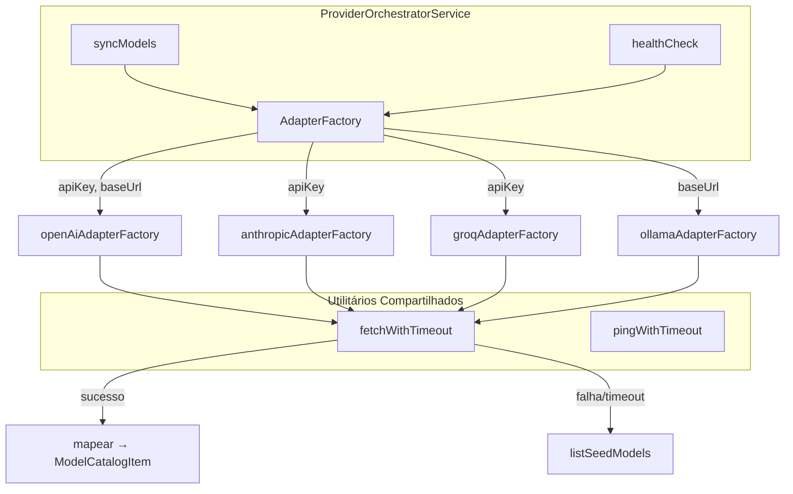
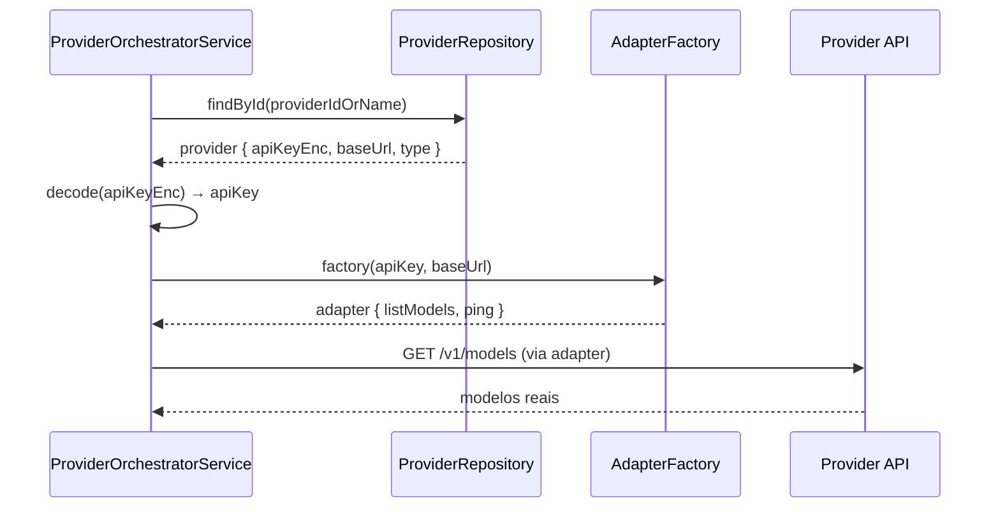

# Design Técnico — real-provider-adapters

## Visão Geral

Esta feature substitui os quatro adapters mock de providers LLM (`openai`, `anthropic`, `groq`, `ollama`) por implementações reais que realizam chamadas HTTP às APIs dos respectivos providers. O objetivo é que `listModels()` retorne modelos reais da conta do usuário e que `ping()` meça latência real de conectividade.

A mudança arquitetural central é a transição de **objetos singleton exportados** para **factory functions parametrizadas**, permitindo que o `ProviderOrchestratorService` injete credenciais (`apiKey`, `baseUrl`) em tempo de execução, decodificadas do campo `provider.apiKeyEnc` (base64 → UTF-8).

Todos os adapters degradam graciosamente para dados de seed (`providerCatalog.ts`) quando a API key está ausente ou a requisição falha.

---

## Arquitetura



### Fluxo de Instanciação



---

## Componentes e Interfaces

### Interface `ProviderAdapter`

```typescript
// src/modules/providers/infrastructure/adapters/adapter.interface.ts

import type { ModelCatalogItem } from '../../domain/entities/provider.entity';

export interface ProviderAdapter {
  listModels(): Promise<Array<Omit<ModelCatalogItem, 'id' | 'providerId'>>>;
  ping(): Promise<{ ok: boolean; latencyMs: number }>;
}

export type AdapterFactory = (apiKey?: string, baseUrl?: string) => ProviderAdapter;
```

### Utilitário `fetchWithTimeout`

```typescript
// src/modules/providers/infrastructure/adapters/http.utils.ts

export async function fetchWithTimeout(
  url: string,
  options: RequestInit,
  timeoutMs: number
): Promise<Response> {
  const controller = new AbortController();
  const timer = setTimeout(() => controller.abort(), timeoutMs);
  try {
    return await fetch(url, { ...options, signal: controller.signal });
  } finally {
    clearTimeout(timer);
  }
}
```

Usa `AbortController` nativo do Node 20 + `fetch` nativo — sem dependências adicionais.

### Utilitário `pingWithTimeout`

```typescript
// src/modules/providers/infrastructure/adapters/http.utils.ts

export async function pingWithTimeout(
  url: string,
  options: RequestInit,
  timeoutMs: number
): Promise<{ ok: boolean; latencyMs: number }> {
  const start = Date.now();
  try {
    await fetchWithTimeout(url, options, timeoutMs);
    return { ok: true, latencyMs: Date.now() - start };
  } catch {
    return { ok: false, latencyMs: timeoutMs };
  }
}
```

### Adapter OpenAI

```typescript
// src/modules/providers/infrastructure/adapters/openai.adapter.ts

const OPENAI_MODELS_URL = 'https://api.openai.com/v1/models';
const ALLOWED_PREFIXES = ['gpt-', 'o1', 'o3', 'o4'];

export const openAiAdapterFactory: AdapterFactory = (apiKey, _baseUrl) => {
  const log = pino({ name: 'adapter:openai' });

  return {
    async listModels() {
      if (!apiKey) return listSeedModels('openai');
      try {
        const res = await fetchWithTimeout(
          OPENAI_MODELS_URL,
          { headers: { Authorization: `Bearer ${apiKey}` } },
          5000
        );
        const json = await res.json() as { data: Array<{ id: string }> };
        return json.data
          .filter(m => ALLOWED_PREFIXES.some(p => m.id.startsWith(p)))
          .map(m => ({
            modelId: m.id,
            displayName: m.id,
            contextWindow: 'unknown',
            capabilities: ['chat'] as Array<'chat'>,
            priceLabel: 'N/A',
            score: 0,
            latencyMs: 0
          }));
      } catch (err) {
        log.warn({ err }, 'openai listModels falhou, usando seed');
        return listSeedModels('openai');
      }
    },
    async ping() {
      if (!apiKey) return { ok: true, latencyMs: 110 }; // seed
      return pingWithTimeout(
        OPENAI_MODELS_URL,
        { headers: { Authorization: `Bearer ${apiKey}` } },
        3000
      );
    }
  };
};
```

### Adapter Anthropic

```typescript
// src/modules/providers/infrastructure/adapters/anthropic.adapter.ts

const ANTHROPIC_MODELS_URL = 'https://api.anthropic.com/v1/models';

export const anthropicAdapterFactory: AdapterFactory = (apiKey, _baseUrl) => {
  const log = pino({ name: 'adapter:anthropic' });
  const headers = {
    'x-api-key': apiKey ?? '',
    'anthropic-version': '2023-06-01'
  };

  return {
    async listModels() {
      if (!apiKey) return listSeedModels('anthropic');
      try {
        const res = await fetchWithTimeout(ANTHROPIC_MODELS_URL, { headers }, 5000);
        const json = await res.json() as { data: Array<{ id: string; display_name: string }> };
        return json.data.map(m => ({
          modelId: m.id,
          displayName: m.display_name,
          contextWindow: 'unknown',
          capabilities: ['chat'] as Array<'chat'>,
          priceLabel: 'N/A',
          score: 0,
          latencyMs: 0
        }));
      } catch (err) {
        log.warn({ err }, 'anthropic listModels falhou, usando seed');
        return listSeedModels('anthropic');
      }
    },
    async ping() {
      if (!apiKey) return { ok: true, latencyMs: 135 }; // seed
      return pingWithTimeout(ANTHROPIC_MODELS_URL, { headers }, 3000);
    }
  };
};
```

### Adapter Groq

```typescript
// src/modules/providers/infrastructure/adapters/groq.adapter.ts

const GROQ_MODELS_URL = 'https://api.groq.com/openai/v1/models';

export const groqAdapterFactory: AdapterFactory = (apiKey, _baseUrl) => {
  const log = pino({ name: 'adapter:groq' });

  return {
    async listModels() {
      if (!apiKey) return listSeedModels('groq');
      try {
        const res = await fetchWithTimeout(
          GROQ_MODELS_URL,
          { headers: { Authorization: `Bearer ${apiKey}` } },
          5000
        );
        const json = await res.json() as { data: Array<{ id: string }> };
        return json.data.map(m => ({
          modelId: m.id,
          displayName: m.id,
          contextWindow: 'unknown',
          capabilities: ['chat'] as Array<'chat'>,
          priceLabel: 'N/A',
          score: 0,
          latencyMs: 0
        }));
      } catch (err) {
        log.warn({ err }, 'groq listModels falhou, usando seed');
        return listSeedModels('groq');
      }
    },
    async ping() {
      if (!apiKey) return { ok: true, latencyMs: 65 }; // seed
      return pingWithTimeout(
        GROQ_MODELS_URL,
        { headers: { Authorization: `Bearer ${apiKey}` } },
        3000
      );
    }
  };
};
```

### Adapter Ollama

```typescript
// src/modules/providers/infrastructure/adapters/ollama.adapter.ts

const DEFAULT_BASE_URL = 'http://localhost:11434';

export const ollamaAdapterFactory: AdapterFactory = (_apiKey, baseUrl) => {
  const log = pino({ name: 'adapter:ollama' });
  const base = baseUrl ?? DEFAULT_BASE_URL;

  return {
    async listModels() {
      try {
        const res = await fetchWithTimeout(`${base}/api/tags`, {}, 5000);
        const json = await res.json() as { models: Array<{ name: string }> };
        return json.models.map(m => ({
          modelId: m.name,
          displayName: m.name,
          contextWindow: 'unknown',
          capabilities: ['chat'] as Array<'chat'>,
          priceLabel: 'N/A',
          score: 0,
          latencyMs: 0
        }));
      } catch (err) {
        log.warn({ err }, 'ollama listModels falhou, usando seed');
        return listSeedModels('ollama');
      }
    },
    async ping() {
      return pingWithTimeout(`${base}/api/tags`, {}, 3000);
    }
  };
};
```

### Mapa de Factories no `ProviderOrchestratorService`

```typescript
// Substituir o mapa estático atual por factories:

const adapterFactories: Partial<Record<ProviderType, AdapterFactory>> = {
  openai: openAiAdapterFactory,
  anthropic: anthropicAdapterFactory,
  ollama: ollamaAdapterFactory,
  groq: groqAdapterFactory
};

// Decodificação de apiKeyEnc:
function decodeApiKey(apiKeyEnc?: string): string | undefined {
  if (!apiKeyEnc) return undefined;
  return Buffer.from(apiKeyEnc, 'base64').toString('utf-8');
}

// Instanciação por chamada (em syncModels e healthCheck):
const factory = adapterFactories[provider.type];
const adapter = factory
  ? factory(decodeApiKey(provider.apiKeyEnc), provider.baseUrl)
  : defaultAdapter(provider.type);
```

---

## Modelos de Dados

### Resposta da API OpenAI / Groq (formato compatível)

```typescript
interface OpenAIModelsResponse {
  data: Array<{ id: string; object: string; created: number; owned_by: string }>;
  object: 'list';
}
```

### Resposta da API Anthropic

```typescript
interface AnthropicModelsResponse {
  data: Array<{ id: string; display_name: string; created_at: string; type: 'model' }>;
}
```

### Resposta da API Ollama

```typescript
interface OllamaTagsResponse {
  models: Array<{ name: string; modified_at: string; size: number }>;
}
```

### Valores Padrão para `ModelCatalogItem`

| Campo           | Valor Padrão |
|-----------------|--------------|
| `contextWindow` | `'unknown'`  |
| `capabilities`  | `['chat']`   |
| `priceLabel`    | `'N/A'`      |
| `score`         | `0`          |
| `latencyMs`     | `0`          |

---

## Propriedades de Correção

*Uma propriedade é uma característica ou comportamento que deve ser verdadeiro em todas as execuções válidas de um sistema — essencialmente, uma declaração formal sobre o que o sistema deve fazer. As propriedades servem como ponte entre especificações legíveis por humanos e garantias de correção verificáveis por máquina.*

### Propriedade 1: Contrato da factory function

*Para qualquer* combinação de `apiKey` (string ou undefined) e `baseUrl` (string ou undefined), a factory function de qualquer adapter deve retornar um objeto que possui os métodos `listModels` e `ping`.

**Valida: Requisitos 1.1, 1.2**

### Propriedade 2: Round-trip de decodificação base64

*Para qualquer* string UTF-8 usada como API key, codificá-la em base64 e depois decodificá-la com `Buffer.from(enc, 'base64').toString('utf-8')` deve retornar a string original.

**Valida: Requisitos 1.3, 10.3**

### Propriedade 3: Filtragem de modelos OpenAI

*Para qualquer* lista de modelos retornada pela API OpenAI, `listModels()` deve retornar apenas modelos cujo `id` começa com um dos prefixos `gpt-`, `o1`, `o3` ou `o4` — nenhum modelo fora desses prefixos deve aparecer no resultado.

**Valida: Requisito 2.2**

### Propriedade 4: Mapeamento de modelos para ModelCatalogItem

*Para qualquer* modelo retornado pela API de qualquer adapter, o objeto `ModelCatalogItem` resultante deve ter `modelId` igual ao identificador do modelo na API, e os campos `contextWindow`, `capabilities`, `priceLabel`, `score` e `latencyMs` devem ser preenchidos com os valores padrão quando a API não os fornece.

**Valida: Requisitos 2.3, 4.2, 6.2, 8.2, 11.1–11.6**

### Propriedade 5: Fallback para seed em caso de falha HTTP

*Para qualquer* tipo de erro lançado pelo `fetch` (erro de rede, timeout, resposta inválida), `listModels()` de qualquer adapter deve retornar os dados de seed correspondentes ao provider, sem propagar a exceção.

**Valida: Requisitos 2.5, 4.4, 6.4, 8.4**

### Propriedade 6: Medição de latência real no ping

*Para qualquer* duração de resposta HTTP simulada dentro do timeout, `ping()` deve retornar `{ ok: true, latencyMs: N }` onde `N` é maior ou igual ao tempo de resposta simulado e menor que o timeout.

**Valida: Requisitos 3.2, 5.2, 7.2, 9.2**

### Propriedade 7: Timeout do ping

*Para qualquer* requisição que exceda 3000ms ou falhe, `ping()` de qualquer adapter deve retornar `{ ok: false, latencyMs: 3000 }`.

**Valida: Requisitos 3.3, 5.3, 7.3, 9.3**

### Propriedade 8: URL dinâmica do Ollama

*Para qualquer* `baseUrl` configurada no adapter Ollama, `listModels()` e `ping()` devem realizar requisições para `{baseUrl}/api/tags` — nunca para uma URL hardcoded.

**Valida: Requisito 8.1**

### Propriedade 9: Instanciação com credenciais corretas no serviço

*Para qualquer* provider com `apiKeyEnc` definido, quando `syncModels()` ou `healthCheck()` for invocado, a factory function deve receber a `apiKey` decodificada de base64 e o `baseUrl` sem transformação.

**Valida: Requisitos 10.1, 10.2, 10.4**

---

## Tratamento de Erros

| Cenário | Comportamento |
|---------|---------------|
| `apiKey` ausente (OpenAI, Anthropic, Groq) | Retorna seed imediatamente, sem chamada HTTP |
| Erro de rede / DNS | `catch` captura, log `warn`, retorna seed |
| Timeout (AbortController) | `fetch` lança `AbortError`, capturado pelo `catch`, retorna seed ou `{ ok: false, latencyMs: 3000 }` |
| Resposta HTTP não-2xx | Tratada como erro (`.json()` pode falhar ou retornar estrutura inesperada), capturada pelo `catch` |
| Ollama não está em execução | `ECONNREFUSED` capturado, retorna seed |
| `apiKeyEnc` undefined no serviço | `decodeApiKey` retorna `undefined`, passado à factory |

O logger Pino nomeado `'adapter:{providerType}'` registra todos os erros de fallback com nível `warn`, incluindo o objeto de erro para rastreabilidade.

---

## Estratégia de Testes

### Localização dos arquivos de teste

```
core/kernel/src/modules/providers/__tests__/
├── openai.adapter.test.ts
├── anthropic.adapter.test.ts
├── groq.adapter.test.ts
├── ollama.adapter.test.ts
├── http.utils.test.ts
└── providerOrchestrator.test.ts  (existente — atualizar)
```

### Abordagem de mock HTTP

Usar `vi.stubGlobal('fetch', mockFn)` do Vitest para interceptar chamadas `fetch` sem dependências externas:

```typescript
import { vi, describe, it, expect, beforeEach, afterEach } from 'vitest';

beforeEach(() => {
  vi.stubGlobal('fetch', vi.fn());
});

afterEach(() => {
  vi.unstubAllGlobals();
});

it('listModels() retorna modelos filtrados da API', async () => {
  vi.mocked(fetch).mockResolvedValueOnce({
    json: async () => ({
      data: [
        { id: 'gpt-4o' },
        { id: 'whisper-1' },   // deve ser filtrado
        { id: 'o3-mini' },
        { id: 'dall-e-3' }     // deve ser filtrado
      ]
    })
  } as Response);

  const adapter = openAiAdapterFactory('sk-test');
  const models = await adapter.listModels();
  expect(models.map(m => m.modelId)).toEqual(['gpt-4o', 'o3-mini']);
});
```

### Testes de propriedade (Vitest + fast-check)

Usar a biblioteca `fast-check` para testes baseados em propriedades, com mínimo de 100 iterações por propriedade:

```typescript
import * as fc from 'fast-check';

// Feature: real-provider-adapters, Property 3: Filtragem de modelos OpenAI
it('filtragem OpenAI: apenas prefixos permitidos passam', async () => {
  await fc.assert(
    fc.asyncProperty(
      fc.array(fc.record({ id: fc.string() }), { minLength: 1 }),
      async (models) => {
        vi.mocked(fetch).mockResolvedValueOnce({
          json: async () => ({ data: models })
        } as Response);

        const adapter = openAiAdapterFactory('sk-test');
        const result = await adapter.listModels();
        const PREFIXES = ['gpt-', 'o1', 'o3', 'o4'];
        return result.every(m => PREFIXES.some(p => m.modelId.startsWith(p)));
      }
    ),
    { numRuns: 100 }
  );
});
```

### Cobertura mínima por adapter

| Cenário | OpenAI | Anthropic | Groq | Ollama |
|---------|--------|-----------|------|--------|
| `listModels()` sem apiKey → seed | ✓ | ✓ | ✓ | N/A |
| `listModels()` com falha HTTP → seed | ✓ | ✓ | ✓ | ✓ |
| `listModels()` com sucesso → mapeamento correto | ✓ | ✓ | ✓ | ✓ |
| `ping()` com sucesso → latência real | ✓ | ✓ | ✓ | ✓ |
| `ping()` com timeout → `{ ok: false, latencyMs: 3000 }` | ✓ | ✓ | ✓ | ✓ |
| `ping()` sem apiKey → seed | ✓ | ✓ | ✓ | N/A |
| URL dinâmica (baseUrl) | N/A | N/A | N/A | ✓ |

### Testes de integração do `ProviderOrchestratorService`

Atualizar `providerOrchestrator.test.ts` para:
- Verificar que `syncModels()` passa `apiKey` decodificada à factory
- Verificar que `healthCheck()` usa factory com credenciais corretas
- Verificar que provider sem `apiKeyEnc` passa `undefined` à factory
