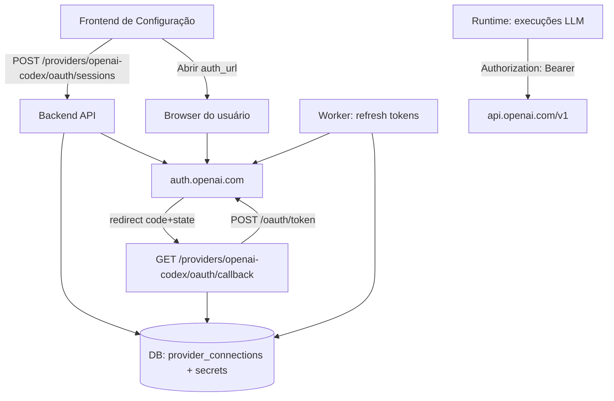
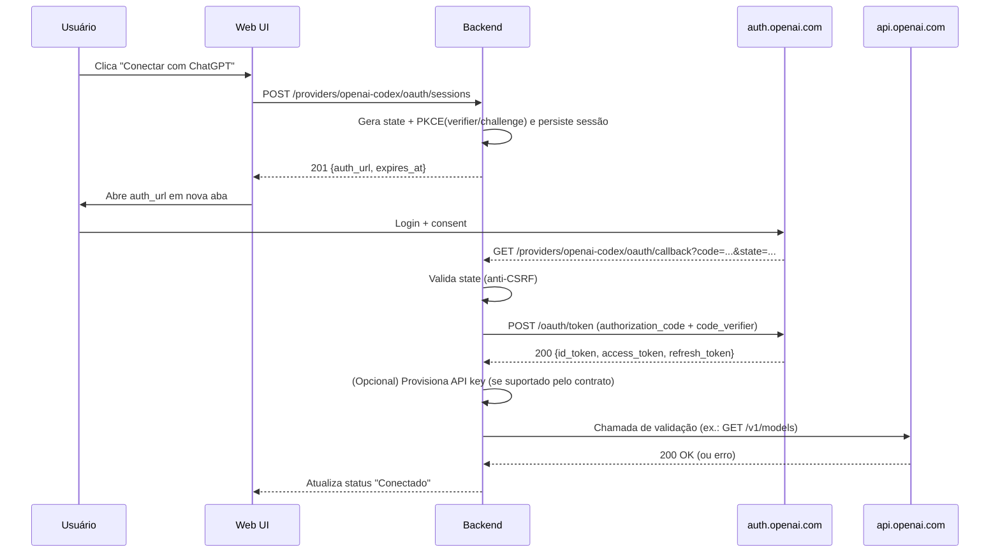

# Integração de um provider OpenAI Codex via link de autenticação em um projeto existente

> **Começando agora?** Se você quer apenas configurar o login do OpenAI Codex no ambiente local ou validar o fluxo sem detalhes técnicos, comece por `docs/suporte/openai-codex-setup.md`.
>
> Esse guia para iniciantes cobre a configuração de `OPENAI_CODEX_WEB_CLIENT_ID`, exemplos de redirect URI, teste manual e solução de problemas. Este arquivo continua sendo a referência técnica detalhada.

> **Como ler este material hoje:** `docs/suporte/openai-codex-setup.md` documenta o comportamento implementado hoje, baseado em **BYO web OAuth client**; `docs/suporte/openai-codex-auth-status.md` registra o status atual, a pausa/deferimento e o bloqueador prático em aberto; este `logincodex.md` permanece como camada técnica e de referência.
>
> Este documento **não deve ser lido como roadmap ativo**. O repositório hoje já preserva um fluxo manual `openai-codex` implementado, mas o conteúdo abaixo continua sendo principalmente material técnico, histórico e de pesquisa sobre a linha de trabalho.

> **Status atual:** o repositório preserva um fluxo manual `openai-codex` já implementado, mas o trabalho mais amplo de OpenAI Codex está **pausado/deferido** até existir um auth/client model viável que não dependa de premissas impraticáveis. Para a conclusão canônica atual e o lembrete de retomada, consulte `docs/suporte/openai-codex-auth-status.md`.

## Resumo executivo

Este relatório propõe uma implementação de provider “Codex/OpenAI (ChatGPT)”, com experiência de configuração baseada em **geração de link** (o usuário abre, autentica com sua conta, concede permissões e o sistema passa a conseguir chamar modelos “Codex-served”). A proposta segue o padrão suportado pelo próprio Codex: o produto suporta **dois métodos de autenticação** — “Sign in with ChatGPT” (acesso via assinatura) e **API key** (cobrança por uso). citeturn11view0

Do ponto de vista técnico, o fluxo “Sign in with ChatGPT” do Codex é um **OAuth 2.0 Authorization Code com PKCE**, com endpoint de autorização em `https://auth.openai.com/oauth/authorize`, troca de código em `https://auth.openai.com/oauth/token`, uso de `code_challenge_method=S256`, `state` e escopos que incluem `openid profile email offline_access …`. citeturn18view2turn19view0turn14search4turn14search2 O Codex também contempla cenários “headless” com **device code authentication (beta)**. citeturn11view0

Há dois pontos críticos de arquitetura/segurança para o seu projeto:

1. **A API da OpenAI é autenticada por API keys** (Bearer), e recomendações de operação/depuração incluem registrar `x-request-id`, headers de rate limit e, opcionalmente, `X-Client-Request-Id`. citeturn7search2turn7search8  
2. O próprio fluxo “Sign in with ChatGPT” do Codex **pode gerar/armazenar um segredo (API key) automaticamente** e a revogação dessa key é **manual** hoje (não há endpoint público para remoção programática do segredo “auto-generated”, segundo o Help Center). citeturn3search0turn22view1

Como **não tive acesso** à documentação interna do seu projeto (SDD, matriz de skills, regras internas e padrões) via arquivos anexados ou conectores nesta conversa, o “prompt técnico” incluído no final vem com **campos/âncoras obrigatórias** para o time preencher com referências explícitas ao SDD e às regras internas antes de codificar (garantindo rastreabilidade e conformidade).

## Evidências e pressupostos

### Evidências técnicas relevantes

O Codex suporta “Sign in with ChatGPT” e API key; Codex cloud exige ChatGPT; CLI/IDE suportam ambos. citeturn11view0

No fluxo OAuth do Codex CLI, o URL de autorização é montado com parâmetros que caracterizam Authorization Code + PKCE (inclusive `code_challenge` e `S256`) e escopos que, na implementação atual do Codex, incluem:

- `openid profile email offline_access api.connectors.read api.connectors.invoke` citeturn18view2

Na troca de código por tokens, o Codex faz `POST {issuer}/oauth/token` com `application/x-www-form-urlencoded` e corpo contendo `grant_type=authorization_code`, `code`, `redirect_uri`, `client_id` e `code_verifier`. A resposta esperada inclui `id_token`, `access_token`, `refresh_token`. citeturn19view0turn22view0

O Codex trata erros específicos na volta do OAuth; por exemplo, detecta um caso de “missing Codex entitlement” e transforma em mensagem amigável (“Codex is not enabled for your workspace…”). citeturn19view2

Em login “headless”, o Codex recomenda **device code authentication (beta)** quando a UI de browser/callback localhost não funciona. citeturn11view0

A API da OpenAI usa **API keys** (Bearer) e fornece headers úteis para depuração e rate limiting (limites/remaining/reset). citeturn7search2turn7search8

### Pressupostos (porque o SDD/documentação interna não está disponível aqui)

| Tema | Decisão assumida (ajustável ao SDD) | Impacto |
|---|---|---|
| Linguagem primária do projeto | **Não especificada**; exemplos serão em **TypeScript/Node** e **Python** conforme solicitado | O time deve adaptar ao stack real |
| Modelo de deployment | Aplicação web com backend (confidential client) | Permite callback HTTPS e armazenamento seguro |
| Tenancy | **Multi-tenant** (workspaces/organizações) | Tokens/keys por tenant e/ou por usuário |
| Banco de dados | **PostgreSQL** | Migrações SQL fornecidas em Postgres |
| Padrão de auth provider | Suporte a **(A) API key** e **(B) ChatGPT OAuth** como opções | Alinha com o Codex (dois métodos) citeturn11view0 |
| Revogação de segredo “auto-generated” | Revogação programática **não garantida**; UX deve orientar revogação manual | Alinha com limitações descritas no Help Center citeturn3search0 |
| PKCE | Usar sempre (mesmo em backend) como hardening | Alinhado ao Codex e RFC 7636 citeturn19view0turn14search4 |

## Arquitetura proposta e mudanças necessárias

### Mudanças arquiteturais mínimas

A implementação do provider deve introduzir um *sub-sistema de “Provider Connections”* (ou extender o existente), com estas responsabilidades:

- **Provider Registry**: registrar “openai-codex” como provider com capacidades (modelos suportados, endpoints, requisitos de auth).
- **Auth Session Service**: criar sessão de OAuth (state, PKCE) e gerar o link para o usuário abrir.
- **OAuth Callback Handler**: receber `code`/`state`, validar, trocar por tokens, persistir credenciais.
- **Credential Vault**: armazenar tokens/segredos criptografados em repouso (KMS/envelope) e expor apenas a runtime autorizada.
- **Token Refresh Worker**: renovar access tokens via refresh token (e lidar com rotação de refresh token), reduzindo falhas em chamadas e evitando reautenticação frequente.
- **LLM Runtime Adapter**: executar chamadas ao OpenAI Responses/Chat APIs com **API key** e registrar metadados (request IDs, rate limit headers) para observabilidade. citeturn7search2turn7search8

### Arquitetura de alto nível (Mermaid)



### Comparativo de opções de design (solicitado)

| Opção | Como funciona | Prós | Contras | Quando escolher |
|---|---|---|---|---|
| API key manual | Usuário cola chave no UI/Secrets | Simples; compatível com a autenticação oficial da API citeturn7search2 | UX pior; risco de vazamento por copy/paste; rotação manual | CI/CD; uso programático; ambientes corporativos com políticas rígidas |
| OAuth “Sign in with ChatGPT” + PKCE | Link → login → code → tokens (`id/access/refresh`) via `/oauth/token` citeturn19view0turn22view0turn14search4 | Melhor UX; reduz atrito de API keys; alinha ao Codex citeturn11view0 | Exige client_id (e possivelmente parceria); revogação automática de key pode não existir citeturn3search0 | Produto voltado a devs; onboarding “um clique”; quando o objetivo é “link + login” |
| Device code (beta) | Usuário abre página e digita código; útil em headless citeturn11view0 | Resolve cenários sem callback acessível | Beta; depende de habilitação do servidor/workspace citeturn11view0 | CLI remota; acesso via SSH; ambientes sem browser |
| Híbrido (recomendado) | UI oferece OAuth e API key como fallback | Maximiza compatibilidade, espelha o Codex citeturn11view0 | Mais testes e superfície de ataque | Produtos gerais e enterprise |

## Fluxo de autenticação e autorização

### Fluxo OAuth recomendado

O fluxo base é OAuth 2.0 Authorization Code, com PKCE (RFC 7636) e `state` para mitigação de CSRF. citeturn14search2turn14search4

**Parâmetros e escopos (baseado no Codex CLI atual):**

- `issuer`: `https://auth.openai.com` (padrão do Codex) citeturn24view0turn19view1  
- `authorize`: `{issuer}/oauth/authorize` citeturn18view2  
- `token`: `{issuer}/oauth/token` citeturn19view0  
- `scope`: `openid profile email offline_access api.connectors.read api.connectors.invoke` citeturn18view2  
- `code_challenge_method`: `S256` citeturn18view2turn14search4  

> Observação operacional: o Codex CLI inclui sinais adicionais como `originator`, `id_token_add_organizations=true` e `codex_cli_simplified_flow=true`. citeturn18view2 Para um provider de terceiro, esses parâmetros podem variar/ser rejeitados — tratar como “compatibilidade com o fluxo Codex” e validar com a fonte oficial/contrato de integração do programa “Sign in with ChatGPT”.

### Diagrama de sequência do onboarding (Mermaid)



### Troca de código por tokens (exemplo HTTP)

O Codex implementa a troca com `application/x-www-form-urlencoded`, contendo `grant_type=authorization_code`, `code`, `redirect_uri`, `client_id` e `code_verifier`. citeturn19view0turn22view0

```http
POST /oauth/token HTTP/1.1
Host: auth.openai.com
Content-Type: application/x-www-form-urlencoded

grant_type=authorization_code&
code=ac_...&
redirect_uri=https%3A%2F%2FSEU_DOMINIO%2Fproviders%2Fopenai-codex%2Foauth%2Fcallback&
client_id=app_...&
code_verifier=VERIFIER_BASE64URL
```

Resposta esperada (o Codex desserializa `id_token`, `access_token`, `refresh_token`). citeturn19view0

```json
{
  "id_token": "eyJ....",
  "access_token": "eyJ....",
  "refresh_token": "eyJ...."
}
```

### Refresh token e rotação

O Codex armazena refresh token e prevê refresh automático durante o uso (para que sessões ativas continuem sem novo login). citeturn11view0turn19view1

Como referência, há trechos públicos na comunidade do Codex que mostram refresh com `grant_type=refresh_token` e `client_id` (mesmo endpoint `/oauth/token`). citeturn13search10

Requisitos recomendados no seu projeto:

- Persistir `refresh_token` **criptografado**; nunca em logs.
- Implementar refresh:
  - **lazy** (ao detectar expiração) e/ou
  - **proativo** (com margem, ex.: renovar quando faltar <10 min).
- Tratar rotação de refresh tokens: se a resposta trouxer um novo refresh token, substituir atomicamente; não manter múltiplos tokens ativos sem necessidade (reduz risco).
- Se houver **endpoint de revogação** no provedor OAuth, usar RFC 7009 quando possível; caso não exista, “disconnect” deve apagar localmente e instruir revogação manual no painel. citeturn14search0turn3search0

### Escopos e permissões

- O conjunto de escopos observado no Codex CLI inclui `offline_access` (refresh token) e permissões `api.connectors.read`/`api.connectors.invoke`. citeturn18view2  
- O Help Center descreve que o consent do Codex envolve refresh token com capacidades como “gerar API keys, consumir créditos e gerenciar a organização de API”. citeturn3search0  

**Implicação de segurança**: esses escopos/permissões são de alto impacto; seu permissionamento interno deve exigir privilégios administrativos para conectar/desconectar este provider e para usar o provider em automações.

### Tratamento de erros relevantes (mínimo)

Erros que precisam de UX e mensagens específicas:

- `state` inválido (CSRF) → bloquear e pedir para reiniciar o fluxo. (O Codex falha com “State mismatch”). citeturn20view1  
- `missing_authorization_code` → reiniciar. citeturn20view1  
- `token_exchange_failed` (falha HTTP/TLS, status não-2xx, body não JSON) → mostrar erro, capturar `x-request-id` quando aplicável e registrar causa sem segredos. citeturn22view0  
- “Codex não habilitado para workspace” (erro `access_denied` com descrição contendo `missing_codex_entitlement`) → ação recomendada: contatar admin do workspace. citeturn19view2  
- Restrição de workspace: se houver política interna de “workspace fixo”, validar claim `chatgpt_account_id` e bloquear se não coincidir. citeturn19view2  
- Persistência falha (DB/KMS) → finalizar com status “conectado parcialmente” e exigir retry. citeturn20view1  

## APIs, dados e migrações

### Endpoints backend propostos (contrato)

Abaixo está um contrato “mínimo e completo” para suportar UI+backend+workers. Ajuste paths/padrões ao SDD.

1. `POST /api/providers/openai-codex/oauth/sessions`  
   Cria sessão de OAuth (state, PKCE, expiração) e retorna `auth_url`.

2. `GET /api/providers/openai-codex/oauth/callback?code=...&state=...`  
   Valida `state`, troca código por tokens e finaliza conexão.

3. `GET /api/providers/openai-codex/connections/:id`  
   Retorna status (connected/disconnected/error), metadados, última renovação, escopos.

4. `POST /api/providers/openai-codex/connections/:id/disconnect`  
   Remove tokens/segredos localmente e orienta revogação manual da key no painel, se aplicável. citeturn3search0

5. (Opcional) `POST /api/providers/openai-codex/connections/:id/refresh`  
   Força refresh (admin/support), com rate limiting e auditoria.

### Exemplos HTTP para sua API interna (solicitado)

**Criar sessão (start):**

```http
POST /api/providers/openai-codex/oauth/sessions HTTP/1.1
Content-Type: application/json

{
  "tenant_id": "11111111-1111-1111-1111-111111111111",
  "requested_by_user_id": "22222222-2222-2222-2222-222222222222",
  "redirect_uri": "https://app.seu-dominio.com/api/providers/openai-codex/oauth/callback"
}
```

Resposta:

```json
{
  "session_id": "33333333-3333-3333-3333-333333333333",
  "auth_url": "https://auth.openai.com/oauth/authorize?...",
  "expires_at": "2026-04-05T15:05:00Z"
}
```

**Callback (finalização):**

```http
GET /api/providers/openai-codex/oauth/callback?code=ac_...&state=... HTTP/1.1
Host: app.seu-dominio.com
```

Resposta (UI pode abrir uma tela de “Conectado com sucesso”):

```json
{
  "connection_id": "44444444-4444-4444-4444-444444444444",
  "status": "connected"
}
```

### Modelo de dados (PostgreSQL) e migração (solicitado)

Abaixo, duas tabelas: uma para conexão e outra para segredos/tokens, permitindo rotação e auditoria.

```sql
-- 001_add_openai_codex_provider.sql

CREATE TABLE provider_connections (
  id                  UUID PRIMARY KEY,
  tenant_id            UUID NOT NULL,
  provider_type        TEXT NOT NULL, -- ex.: 'openai-codex'
  display_name         TEXT NOT NULL,
  status               TEXT NOT NULL, -- 'pending'|'connected'|'error'|'disconnected'
  created_by_user_id   UUID NOT NULL,
  created_at           TIMESTAMPTZ NOT NULL DEFAULT now(),
  updated_at           TIMESTAMPTZ NOT NULL DEFAULT now(),
  last_used_at         TIMESTAMPTZ NULL,
  last_error_code      TEXT NULL,
  last_error_message   TEXT NULL,
  metadata             JSONB NOT NULL DEFAULT '{}'::jsonb
);

CREATE INDEX idx_provider_connections_tenant
  ON provider_connections (tenant_id, provider_type);

CREATE TABLE provider_credentials (
  id                   UUID PRIMARY KEY,
  connection_id         UUID NOT NULL REFERENCES provider_connections(id) ON DELETE CASCADE,
  credential_kind       TEXT NOT NULL, -- 'oauth_id_token'|'oauth_access_token'|'oauth_refresh_token'|'openai_api_key'
  encrypted_value       BYTEA NOT NULL,
  expires_at            TIMESTAMPTZ NULL, -- para access token / id token quando aplicável
  scope                 TEXT NULL,
  rotated_at            TIMESTAMPTZ NULL,
  created_at            TIMESTAMPTZ NOT NULL DEFAULT now(),
  updated_at            TIMESTAMPTZ NOT NULL DEFAULT now(),
  UNIQUE (connection_id, credential_kind)
);

CREATE TABLE oauth_sessions (
  id                   UUID PRIMARY KEY,
  tenant_id             UUID NOT NULL,
  connection_id         UUID NULL REFERENCES provider_connections(id) ON DELETE SET NULL,
  state_hash            BYTEA NOT NULL,
  pkce_verifier_enc     BYTEA NOT NULL,
  redirect_uri          TEXT NOT NULL,
  expires_at            TIMESTAMPTZ NOT NULL,
  created_at            TIMESTAMPTZ NOT NULL DEFAULT now()
);

CREATE INDEX idx_oauth_sessions_tenant_exp
  ON oauth_sessions (tenant_id, expires_at);
```

**Notas de migração/compatibilidade:**

- Se o projeto já tem um “vault/secrets table”, reutilize-o e substitua `provider_credentials` por referência a secret IDs.
- Se houver “audit log” no SDD, toda criação/refresh/disconnect deve gerar evento de auditoria separado do log de aplicação.

### Variáveis de configuração necessárias (solicitado)

| Variável | Exemplo | Obrigatória | Observação |
|---|---:|:---:|---|
| `OPENAI_OAUTH_ISSUER` | `https://auth.openai.com` | Sim | Issuer observado no Codex citeturn24view0 |
| `OPENAI_OAUTH_CLIENT_ID` | `app_...` | Sim | Necessita provisionamento oficial/contrato |
| `OPENAI_OAUTH_CLIENT_SECRET` | `...` | Depende | Se o cliente for “confidential”; PKCE recomendado mesmo assim citeturn14search4 |
| `OPENAI_OAUTH_SCOPES` | `openid profile email offline_access ...` | Sim | Escopos observados no Codex CLI citeturn18view2 |
| `OPENAI_OAUTH_REDIRECT_URI` | `https://app.../callback` | Sim | Deve estar cadastrado no provedor |
| `OPENAI_API_BASE_URL` | `https://api.openai.com/v1` | Sim | Base padrão da API |
| `PROVIDER_SECRETS_KMS_KEY_ID` | `kms://...` | Sim | Chave para envelope encryption (se aplicável ao SDD) |
| `PROVIDER_OAUTH_SESSION_TTL_MIN` | `10` | Não | TTL de sessão curta (recomendado) |

## Confiabilidade, segurança, observabilidade e limites

### Considerações de segurança

**Proteções OAuth (mínimo obrigatório):**

- `state` obrigatório e validado (mitiga CSRF). citeturn14search2turn20view1  
- PKCE com `S256` (mitiga interception de code). citeturn14search4turn18view2  
- Sessões de OAuth com TTL curto e uso único; ao completar, invalidar `state` imediatamente.

**Higiene de segredo e logs:**

- Nunca logar `code`, `code_verifier`, tokens, API key.
- Adotar lista de “chaves sensíveis” semelhante ao Codex (ele explicitly trata `access_token`, `api_key`, `client_secret`, `code`, `code_verifier` como sensíveis). citeturn22view2  
- Criptografar tokens em repouso (KMS/env), e limitar o acesso aos segredos por RBAC interno (somente o runtime e admins).

**Modelo de permissões da API key (quando aplicável):**

A plataforma permite criar keys com permissões “All / Restricted / Read Only” e, no modo “Restricted”, ajustar none/read/write por endpoint. citeturn7search0  
Recomendação: se o seu fluxo conseguir criar key programaticamente ou instruir o usuário na UI, orientar a menor permissão útil (tipicamente permitir somente `/v1/responses` e leitura de modelos se necessário).

**Revogação/Disconnect:**

- O Help Center descreve que “Disconnect” no Codex remove o grant OAuth, mas a API key “auto-generated” permanece ativa; e que a revogação programática da key não é pública hoje. citeturn3search0  
- Portanto: ao desconectar no seu produto, você deve:
  - deletar tokens locais;
  - instruir o usuário a revogar a key no painel, se você armazenou/provisionou uma key.

### Observabilidade, logging e telemetria

**Recomendações de baixo risco (alinhadas à OpenAI):**

- Registrar `x-request-id` e, quando você enviar, `X-Client-Request-Id` (ID interno de trace). citeturn7search2  
- Registrar headers `x-ratelimit-*` para tuning de throughput e detectar gargalos. citeturn7search2turn7search8  

**Desenho de telemetry inspirado no Codex (OTel):**

O Codex descreve um pipeline de OTel com:
- redaction de prompt por padrão (`log_user_prompt=false`);
- eventos estruturados para `api_request`, `sse_event`, `tool_result`, etc. citeturn12view1  

Sugestão para seu projeto (mínimo):

- `provider.auth.session_created` (tenant_id, connection_id, expires_in)
- `provider.auth.callback_received` (state_valid, has_code, has_error)
- `provider.auth.token_exchange` (http_status, duration_ms, error_code)
- `provider.auth.refresh` (success, rotated_refresh_token, next_expires_at)
- `provider.llm.request` (model, tokens_in/out quando disponível, http_status, openai_request_id)

### Rate limits e tratamento

A OpenAI documenta rate limits medidos em RPM/TPM/etc, com detalhes sobre headers e estratégias (exponential backoff com jitter, batch, ajuste de `max_tokens`). citeturn7search8turn7search2  

Modelos “Codex” expõem tabelas de rate limit por tier na documentação de modelos (ex.: GPT-5.2-Codex / GPT-5.3-Codex). citeturn8search3turn8search2  

Requisitos de robustez:

- Implementar retries com backoff para `429`, `500`, `502`, `503`; parar após limite (evitar tempestade de retries).
- Respeitar `x-ratelimit-reset-*` e/ou `Retry-After` quando presente.
- Emitir métrica `rate_limit_hit` por tenant/modelo.

## Plano de entrega: testes, CI/CD, rollback e estimativa

### Estratégia de testes (unit / integration / e2e)

**Unit tests (exemplos):**
- PKCE: `code_verifier` e `code_challenge` conformes RFC 7636 (S256). citeturn14search4  
- `state` generation + validação + uso único.
- Parser de erro OAuth: mapear `access_denied` + `missing_codex_entitlement` para mensagem/erro interno. citeturn19view2  
- Redaction: garantir que logs não serializam chaves sensíveis (lista semelhante à do Codex). citeturn22view2  

**Integration tests:**
- Simular `auth.openai.com` via mock server para `/oauth/token` retornando:
  - sucesso com `id_token/access_token/refresh_token`; citeturn19view0  
  - erro 4xx/5xx e body não JSON (o Codex preserva texto em erro). citeturn22view0  
- Simular refresh token flow (mock).

**E2E tests:**
- Fluxo UI completo: “Gerar link” → abrir link → callback → status “conectado”.
- “Disconnect” remove acesso e mostra instruções de revogação manual.
- Cenário de erro: callback com `state` inválido; UX orienta retry.

### Ajustes de CI/CD

- Adicionar job de **secret scanning** (garantir que exemplos/fixtures não contêm tokens).
- Adicionar verificação de migração (aplicar/rollback em ambiente ephemeral).
- Se houver pipeline de SBOM ou SAST, incluir dependências OAuth/crypto (PKCE, jose/jwt).

### Rollback plan (operacional)

- Feature flag `providers.openai_codex.enabled` (default off → gradual rollout por tenant).
- Migração reversível:
  - Down migration: dropar tabelas `oauth_sessions` e `provider_credentials` (se não forem compartilhadas).
- Em caso de incidentes:
  - desabilitar feature flag;
  - bloquear novas conexões;
  - manter credenciais existentes inacessíveis ao runtime (toggle de enforcement);
  - comunicação aos usuários para revogar chaves se necessário.

### Estimativa de esforço por tarefa (horas)

> Estimativas assumem time com familiaridade prévia com OAuth/PKCE e com o framework do projeto; ajustar conforme matriz de skills interna (não disponível aqui).

| Entrega | Subtarefas | Horas |
|---|---|---:|
| Levantamento + alinhamento com SDD/regras internas | Mapear interfaces existentes de providers, RBAC, logging, padrões de migração | 8–12 |
| Backend: modelo de dados + migrações | Tabelas, encryption hooks, backfill (se necessário) | 10–16 |
| Backend: endpoint de sessão (gerar link) | state+pkce, persistência, TTL, rate limit | 8–12 |
| Backend: callback + token exchange | validação state, `/oauth/token`, storage, error mapping | 12–18 |
| Worker de refresh | scheduler, locking, rotação, métricas | 10–16 |
| Runtime adapter: chamadas aos modelos | integração Responses API, headers, request IDs, backoff | 10–16 |
| UI/UX | tela config, botão “abrir link”, estados, erros e instruções de revogação | 10–18 |
| Testes | unit+integration+e2e, mocks, regression | 16–24 |
| Observabilidade | logs estruturados + OTel, dashboards, alertas | 8–14 |
| Docs internos | runbook, troubleshooting, ADR/SDD update | 6–10 |

## Prompt técnico para a equipe OpenCode

> **Uso**: o texto abaixo é um “prompt de implementação” para ser colado no sistema interno de execução/especificação do time entity["organization","OpenCode","internal engineering team"]. Ele contém *blocos obrigatórios* de rastreabilidade ao SDD e à matriz de skills — preencher antes de iniciar PR.

```text
TÍTULO
Adicionar provider "openai-codex" com onboarding via link (ChatGPT OAuth) + fallback por API Key

CONTEXTO
Estamos adicionando um provider de modelos Codex/OpenAI a um projeto existente. O provider deve permitir que, durante a configuração, o sistema gere um link; ao abrir o link, o usuário autentica com sua conta (ChatGPT/OpenAI) e o sistema ganha acesso a modelos “Codex-served”.
O Codex (produto oficial) suporta 2 métodos de autenticação: (1) Sign in with ChatGPT e (2) API key. Implementar ambos como opções (OAuth como padrão; API key como fallback), alinhando com as práticas do Codex.

REFERÊNCIAS INTERNAS (OBRIGATÓRIO PREENCHER)
- SDD: [LINK/ID] + Seções impactadas: [ex.: §2 Arquitetura, §4 Segurança, §7 Observabilidade]
- Regras internas (coding standards): [LINK/ID] + itens aplicáveis: [ex.: logging, error taxonomy, migrations]
- Skills matrix: [LINK/ID] + papéis aprovadores: [ex.: Auth SME, Security reviewer, DB reviewer]
- ADRs anteriores relevantes: [LINK/ID]

FONTES PRIMÁRIAS EXTERNAS (para consulta e validação)
- Codex Auth docs: developers.openai.com/codex/auth
- Implementação OAuth do Codex (referência conceitual): openai/codex login server.rs (escopos, PKCE, token exchange)
- OpenAI API Auth + headers: platform.openai.com/docs/api-reference/authentication
- Rate limits: platform.openai.com/docs/guides/rate-limits
- RFC 6749 (OAuth 2.0), RFC 7636 (PKCE), RFC 7009 (revogação)

ESCOPO DO TRABALHO
1) Arquitetura
- Registrar provider "openai-codex" no registry de providers (capabilities, modelos, endpoints).
- Adicionar serviço de OAuth sessions (state + PKCE), callback handler e Credential Vault (segredos criptografados).
- Adicionar worker de refresh de tokens com travas (evitar concorrência).

2) Auth flows
A) OAuth (default)
- Authorization Code + PKCE (S256), com state obrigatório.
- authorize endpoint: https://auth.openai.com/oauth/authorize
- token endpoint: https://auth.openai.com/oauth/token
- scopes mínimos: openid profile email offline_access (+ escopos adicionais se exigidos por contrato)
- Troca de code por tokens: form-urlencoded com grant_type=authorization_code, code, redirect_uri, client_id, code_verifier.
- Armazenar id_token, access_token, refresh_token e metadados (expires_at, scope).

B) API key (fallback)
- Permitir que usuário forneça API key (Bearer) e armazenar de forma segura.
- Orientar permissões mínimas em UI (All/Restricted/Read Only, conforme plataforma permitir).

3) Endpoints backend
- POST /api/providers/openai-codex/oauth/sessions
- GET /api/providers/openai-codex/oauth/callback
- GET /api/providers/openai-codex/connections/:id
- POST /api/providers/openai-codex/connections/:id/disconnect
- (Opcional) POST /api/providers/openai-codex/connections/:id/refresh (admin-only)

4) Banco de dados + migrações
- Criar/estender tabelas: provider_connections, provider_credentials, oauth_sessions.
- Segredos devem ser criptografados (envelope/KMS) e nunca logados.
- Incluir migration + rollback.
- Incluir script para limpar sessões expiradas.

5) UI/UX
- Tela de configuração do provider:
  - Botão "Conectar com ChatGPT" -> gera e exibe link + abre em nova aba.
  - Estados: pending, connected, error, disconnected.
  - Mensagens amigáveis; caso “Codex não habilitado para workspace”, orientar contatar admin.
  - “Disconnect”: remover credenciais locais e instruir revogação manual de API key no painel, se aplicável (não assumir endpoint público de revoke).
  - Fallback: campo para colar API key.

6) Segurança
- PKCE (S256) e state obrigatório.
- TTL curto para sessão OAuth; uso único.
- Redaction de logs: nunca registrar code, verifier, tokens, api key.
- Permissões internas: somente admins podem conectar/desconectar provider; runtime acessa secrets via service account interna.
- Threat model e checklist de segurança (ver seção abaixo).

7) Observabilidade
- Log estruturado para:
  - oauth_session_created, oauth_callback_received, token_exchange (status/duration), refresh (success/rotation), provider_llm_request (model/status/openai_request_id)
- Registrar x-request-id e x-ratelimit-* (se aplicável) para troubleshooting.
- Métricas/alertas: taxa de 401/403, taxa de 429, falhas de refresh, expiração de tokens.

8) Testes
- Unit: PKCE, state, parsing/mapping de erros, redaction.
- Integration: mock do /oauth/token; flows sucesso/erro; refresh.
- E2E: fluxo UI completo + disconnect.
- Segurança: teste garantindo ausência de segredos em logs e em responses.

9) CI/CD
- Atualizar pipelines: migrations, secret scanning, e2e em ambiente ephemeral.
- Gates: aprovação Security + Auth SME + DB reviewer (conforme skills matrix interna).

10) Entregáveis adicionais
- Documentação interna atualizada: runbook, troubleshooting, e decisões (ADR).
- Exemplos obrigatórios:
  - Fornecer exemplos de integração em TypeScript/Node e em Python.
  - Incluir exemplos HTTP (requests/responses) e SQL migrations no PR/SDD.

ASSUNÇÕES (PREENCHER/VALIDAR)
- Tenancy: [single/multi]
- Banco: [Postgres/MySQL]
- Stack backend: [Node/Java/Go/Python/...]
- Existe credencial OAuth (client_id/secret) oficial para nosso app? [sim/não - se não, habilitar apenas API key]
- Existe endpoint suportado para provisionar API key via OAuth? [sim/não/indefinido - se indefinido, não implementar “auto-key provisioning” sem validação legal/contratual]

CHECKLIST DE CODE REVIEW
- [ ] Está rastreável ao SDD e às regras internas (links no PR)?
- [ ] PKCE + state ok; validação CSRF ok; TTL sessão ok
- [ ] Segredos criptografados; nenhum segredo em logs/telemetria
- [ ] RBAC aplicado (admin-only para connect/disconnect)
- [ ] Tratamento de erros: state mismatch, token exchange failed, missing codex entitlement, workspace restriction
- [ ] Rate limits: backoff, respeito a headers de reset, limites por tenant
- [ ] Observabilidade: x-request-id, x-ratelimit-* registrados; dashboards/alertas atualizados
- [ ] Test coverage: unit + integration + e2e com mocks determinísticos
- [ ] Migração e rollback testados em CI
- [ ] Runbook + docs atualizados

CHECKLIST DE SECURITY AUDIT
- [ ] Revisão de threat model (token theft, CSRF, replay, open redirect, SSRF)
- [ ] Revisão de criptografia e rotação de keys
- [ ] Revisão de possíveis escaladas multi-tenant
- [ ] Revisão de logs (PII, tokens, headers sensíveis)
- [ ] Plano de resposta a incidentes (revogar tokens, invalidar sessões, feature flag)
```

### Exemplos de código solicitados (TypeScript/Node e Python)

> **Nota**: como a linguagem primária do projeto está **não especificada**, os snippets abaixo são “referências portáveis” e devem ser adaptados ao framework real.

#### TypeScript/Node — gerar PKCE + auth_url + token exchange

```ts
import crypto from "crypto";

function base64url(buf: Buffer): string {
  return buf.toString("base64").replace(/\+/g, "-").replace(/\//g, "_").replace(/=+$/g, "");
}

export function generatePkce(): { verifier: string; challenge: string } {
  const verifier = base64url(crypto.randomBytes(32));
  const hash = crypto.createHash("sha256").update(verifier).digest();
  const challenge = base64url(hash);
  return { verifier, challenge };
}

export function buildAuthorizeUrl(params: {
  issuer: string;                 // ex: https://auth.openai.com
  clientId: string;               // app_...
  redirectUri: string;            // https://app.../oauth/callback
  state: string;                  // random, armazenar hash
  codeChallenge: string;          // PKCE
  scope: string;                  // "openid profile email offline_access ..."
}) {
  const u = new URL(`${params.issuer}/oauth/authorize`);
  u.searchParams.set("response_type", "code");
  u.searchParams.set("client_id", params.clientId);
  u.searchParams.set("redirect_uri", params.redirectUri);
  u.searchParams.set("scope", params.scope);
  u.searchParams.set("code_challenge", params.codeChallenge);
  u.searchParams.set("code_challenge_method", "S256");
  u.searchParams.set("state", params.state);
  return u.toString();
}

export async function exchangeCodeForTokens(opts: {
  issuer: string;
  clientId: string;
  redirectUri: string;
  code: string;
  codeVerifier: string;
}) {
  const body = new URLSearchParams({
    grant_type: "authorization_code",
    code: opts.code,
    redirect_uri: opts.redirectUri,
    client_id: opts.clientId,
    code_verifier: opts.codeVerifier,
  });

  const resp = await fetch(`${opts.issuer}/oauth/token`, {
    method: "POST",
    headers: { "Content-Type": "application/x-www-form-urlencoded" },
    body,
  });

  if (!resp.ok) {
    const text = await resp.text();
    throw new Error(`token_exchange_failed status=${resp.status} body=${text}`);
  }

  const json = await resp.json() as {
    id_token: string;
    access_token: string;
    refresh_token: string;
  };

  return json;
}
```

#### Python — gerar PKCE + token exchange

```python
import base64
import hashlib
import os
import urllib.parse
import requests

def b64url(raw: bytes) -> str:
    return base64.urlsafe_b64encode(raw).decode("utf-8").rstrip("=")

def generate_pkce():
    verifier = b64url(os.urandom(32))
    challenge = b64url(hashlib.sha256(verifier.encode("utf-8")).digest())
    return verifier, challenge

def exchange_code_for_tokens(issuer: str, client_id: str, redirect_uri: str, code: str, code_verifier: str):
    data = {
        "grant_type": "authorization_code",
        "code": code,
        "redirect_uri": redirect_uri,
        "client_id": client_id,
        "code_verifier": code_verifier,
    }
    resp = requests.post(
        f"{issuer}/oauth/token",
        headers={"Content-Type": "application/x-www-form-urlencoded"},
        data=urllib.parse.urlencode(data),
        timeout=20,
    )
    if resp.status_code // 100 != 2:
        raise RuntimeError(f"token_exchange_failed status={resp.status_code} body={resp.text}")
    return resp.json()
```

#### Exemplo de chamada à OpenAI API (Responses API) usando API key

A autenticação oficial da API é via `Authorization: Bearer OPENAI_API_KEY`. citeturn7search2

```bash
curl https://api.openai.com/v1/responses \
  -H "Authorization: Bearer $OPENAI_API_KEY" \
  -H "Content-Type: application/json" \
  -H "X-Client-Request-Id: 123e4567-e89b-12d3-a456-426614174000" \
  -d '{
    "model": "gpt-5.2-codex",
    "input": "Explique o que este trecho faz e sugira melhorias."
  }'
```

### Nota final sobre conformidade com documentação interna

Para cumprir o requisito “seguir estritamente SDD/regras/skills matrix”, é indispensável que o time injete no prompt: IDs/links das seções do SDD, padrões de logging/migração do repositório, e gates de aprovação. Sem esses artefatos anexados/conectados nesta conversa, eu forneci um **template rigoroso com pontos de ancoragem**; mas a conformidade “estrita” só é garantida após o preenchimento desses campos pelo time com as fontes internas reais.
